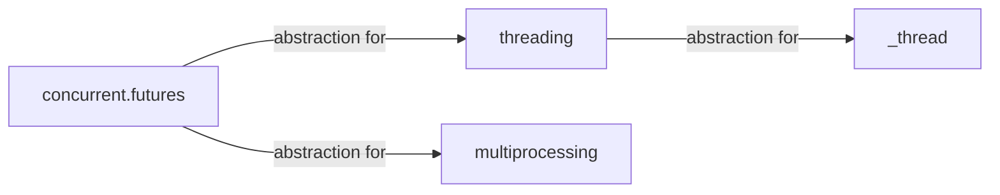

---
last_modified_at:
title: "Python Asyncio Study notes"
excerpt: ""
tags:
  - python
  - async
published: false
# header:
#   teaserlogo:
#   teaser: ''
#   image: ''
#   caption:
gallery:
  - image_path: ''
    url: ''
    title: ''
---

## concurrent.futures

The [`concurrent.futures`](https://docs.python.org/3.9/library/concurrent.futures.html) is a high-level abstraction for the `threading` and `multiprocessing` modules.

