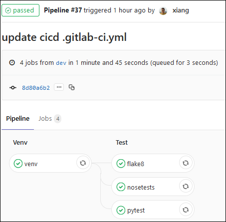
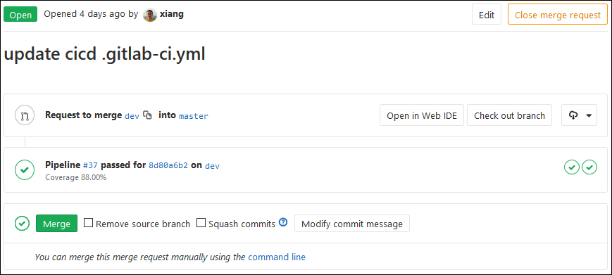

---
authors:
- copdips
categories:
- gitlab
- cicd
- python
- powershell
comments: true
date:
  created: 2018-10-18
description: Gitlab ships with its own free CICD which works pretty well. This post
  will give a .gitlab-ci.yml demo for a Python project running on Gitlab Windows runner.
---

# Using Gitlab integrated CICD for Python project on Windows

Gitlab ships with its own free CICD which works pretty well. This post will give you an example of the CICD file `.gitlab-ci.yml` for a Python project running on [Gitlab Windows runner](https://copdips.com/2018/09/install-gitlab-runner-on-windows-by-powershell-psremoting.html).

<!-- more -->

## Some docs on the Internet

1. [Official GitLab Continuous Integration (GitLab CI/CD)](https://docs.gitlab.com/ee/ci/README.html)
2. [Official Configuration of your jobs with .gitlab-ci.yml](https://docs.gitlab.com/ee/ci/yaml/README.html)
3. [Official Gitlab Pipelines settings](https://docs.gitlab.com/ee/user/project/pipelines/settings.html)
4. [Official Publish code coverage report with GitLab Pages](https://about.gitlab.com/2016/11/03/publish-code-coverage-report-with-gitlab-pages/)
5. [introduction-gitlab-ci](https://blog.eleven-labs.com/fr/introduction-gitlab-ci/)
6. [Rubular: a Ruby regular expression editor and tester](http://rubular.com/)

## Code Coverage

The official doc on how to use coverage is not very clear.

My coverage tool's output (from `pytest --cov=`) is something like :

```shell
----------- coverage: platform win32, python 3.7.0-final-0 -----------
Name                                      Stmts   Miss  Cover
-------------------------------------------------------------
python_project\__init__.py                    6      0   100%
python_project\ctx_fetcher.py                15      0   100%
python_project\extras\__init__.py             0      0   100%
python_project\extras\celery.py              18     18     0%
python_project\filters.py                     6      2    67%
python_project\parser.py                     26      0   100%
python_project\request_id.py                 42      1    98%
-------------------------------------------------------------
TOTAL                                       113     21    81%
```

In my example [.gitlab-ci.yml](https://copdips.com/2018/10/using-gitlab-integrated-cicd-for-python-project-on-windows.html#gitlab-ci-yml-file-content), the coverage is configured as:

```yaml
coverage: '/^TOTAL.*\s+(\d+\%)$/'
```

This regex will find the coverage which is at `81%`.

**Be aware that**:

1. The coverage only use regular expression to find the coverage percentage from coverage tool's output.
2. The regular expression must be surrounded by single quote `'`, double quote is not allowed.
3. Inside the single quotes, must be surrounded by `/`.
4. You can use <http://rubular.com> to test your regex.
5. The overage regex returns the last catch group value from the output. Even if it is not in the last line, or if the regex catches more than one values among all the lines.

## .gitlab-ci.yml example for Python project on a Windows runner

## .gitlab-ci.yml file content

I cloned the project [flask_log_request_id](https://github.com/Workable/flask-log-request-id) and try to run CICD over it.

!!! note

    I'm still working on this CICD `.gitlab-ci.yml` file, the example given here will be updated as long as I add new things inside.

```yaml
stages:
    - venv
    - test
    - build
    - deploy

before_script:
  - $gitApiUrl = 'https://gitlab.copdips.local/api/v4'
  # will save git api token more securely later.
  - $gitApiToken = $env:GitApiToken
  - $gitApiHeader = @{"PRIVATE-TOKEN" = $gitApiToken}
  - $cicdReportsFolderPath = Join-Path (Get-Location) "cicd_reports"
  - $venvPath = "$env:temp/venv/$($env:CI_PROJECT_NAME)"
  - >
    function Set-SecurityProtocolType {
        # [Net.ServicePointManager]::SecurityProtocol = [Net.SecurityProtocolType]::Tls12
        # $AllProtocols = [System.Net.SecurityProtocolType]'Ssl3,Tls,Tls11,Tls12'
        $AllProtocols = [System.Net.SecurityProtocolType]'Tls12'
        [System.Net.ServicePointManager]::SecurityProtocol = $AllProtocols
    }
  - >
    function Write-PythonPath {
        $pythonPath = $(Get-Command python | % source)
        Write-Output "The python path is at: '$pythonPath'"
    }
  - >
    function Get-UpstreamProject {
        $apiParam = @{
          Headers = $gitApiHeader
          Uri = "$gitApiUrl/projects?search=$($env:CI_PROJECT_NAME)"
        }
        if ($PSVersionTable.PSVersion.Major -gt 5) {
          $apiParam.SkipCertificateCheck = $true
        }
        $projectList = Invoke-RestMethod @apiParam
        $upstreamProject = $projectList | ? forked_from_project -eq $null
        return $upstreamProject
    }
  - >
    function Get-UpstreamProjectId {
        $upstreamProject = Get-UpstreamProject
        return $upstreamProject.id
    }

  - >
    function Test-CreateVenv {
        param($VenvPath, $GitCommitSHA)
        $gitShowCommand = "git show $GitCommitSHA --name-only"
        $gitShowResult = Invoke-Expression $gitShowCommand
        Write-Host "$gitShowCommand`n"
        $gitShowResult | ForEach-Object {Write-Host $_}
        $changedFiles = Invoke-Expression "git diff-tree --no-commit-id --name-only -r $GitCommitSHA"
        $requirementsFiles = @()
        $requirementsFiles += "requirements.txt"
        foreach ($requirements in $requirementsFiles) {
            if ($requirements -in $changedFiles) {
                Write-Host "`nFound $requirements in the changed files, need to create venv."
                return $True
            }
        }
        if (-not (Test-Path $VenvPath)) {
            Write-Host "`nCannot found venv at $VenvPath, need to create venv."
            return $True
        }

        Write-Host "`nNo need to create venv."
        return $False
    }
  - >
    function Enable-Venv {
        param($VenvPath)

        Invoke-Expression (Join-Path $VenvPath "Scripts/activate.ps1")
        Write-Host "venv enabled at: $VenvPath"
        Write-PythonPath
    }
  - >
    function Create-Venv {
        param($VenvPath)

        Write-Output "Creating venv at $venvPath ."
        python -m venv $VenvPath
        Write-Output "venv created at $venvPath ."
    }
  - >
    function Install-PythonRequirements {
        param($VenvPath)

        Enable-Venv $VenvPath
        python -m pip install -U pip setuptools wheel
        pip install -r requirements.txt
    }
  - >
    function Remove-Venv {
        param($VenvPath)

        if (Test-Path $VenvPath) {
            Remove-Item $VenvPath -Recurse -Force
            Write-Host "venv removed from: $VenvPath"
        } else {
            Write-Host "venv not found at: $VenvPath"
        }
    }
  - Get-Location
  - git --version
  - python --version
  - Write-PythonPath
  - $PSVersionTable | ft -a
  - Get-ChildItem env:\ | Select-Object Name, Value | ft -a

venv:
  stage: venv
  script:
    - >
      if (Test-CreateVenv $venvPath $env:CI_COMMIT_SHA) {
          Remove-Venv $venvPath
          Create-Venv $venvPath
      }
      Install-PythonRequirements $venvPath

pytest:
  stage: test
  script:
    - $reportFolder = Join-Path $cicdReportsFolderPath "pytest"
    - New-Item -Path $reportFolder -Type Directory -Force
    - $upstreamProjectId = Get-UpstreamProjectId
    - Write-Output "upstreamProjectId = $upstreamProjectId"
    # TODO: add check master last commit coverage
    - Enable-Venv $venvPath
    - pytest --cov=flask_log_request_id --cov-report=html:$reportFolder
    - $coverageLine = (Get-Content (Join-Path $reportFolder index.html) | Select-String "pc_cov").line
    - $coverageString = ($coverageLine -replace "<[^>]*>", "").trim()
    - Write-Output "Total Coverage = $coverageString"
  coverage: '/^(?i)(TOTAL).*\s+(\d+\%)$/'


nosetests:
  stage: test
  script:
    - Enable-Venv $venvPath
    - nosetests.exe
  coverage: '/^TOTAL.*\s+(\d+\%)$/'

flake8:
  stage: test
  script:
    - Enable-Venv $venvPath
    - flake8.exe .\flask_log_request_id

mypy:
  stage: test
  script:
    - Enable-Venv $venvPath
    - $reportFolder = Join-Path $cicdReportsFolderPath "mypy"
    - New-Item -Path $reportFolder -Type Directory -Force
    - $mypyResult = mypy ./flask_log_request_id --ignore-missing-imports --html-report $reportFolder --xml-report $reportFolder
    - Write-Output "MyPy result = `""
    - $mypyResult | % { Write-Output $_}
    - Write-Output "`"`nEnd of MyPy result."
    - if ($mypyResult.count -gt 2) {
          return $False
      }
```

## .gitlab-ci.yml results from pipeline view



## .gitlab-ci.yml results from job view


## .gitlab-ci.yml results from merge_request view


