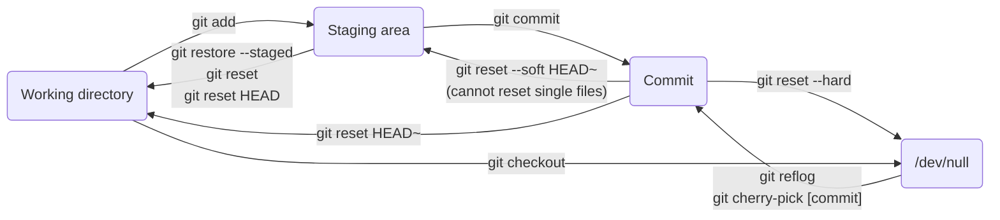
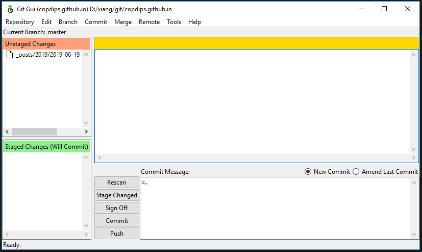

---
authors:
- copdips
categories:
- git
comments: true
date:
  created: 2019-06-19
  updated: 2024-11-24
description: Some personal often forgotten git commands.
---

# Git Cheat Sheet

This is not a complete Git cheat sheet for everyone, this is just a personal cheat sheet for some often forgotten git commands.

<!-- more -->

## Alias

User level alias

Edit `~/.gitconfig`

```ini
git config --global alias.amend commit --amend -C HEAD
git config --global alias.st status
git config --global alias.lga log --graph --decorate --oneline --all
git config --global alias.co checkout
git config --global alias.last log -1 HEAD
git config --global alias.ci commit
git config --global alias.unstage reset HEAD
git config --global alias.ll "log --graph --all --pretty=format:'%C(auto)%h%Creset %an: git config --global %s - %Creset %C(auto)%d%Creset %C(bold black)(%cr)%Creset %C(bold git config --global black)(%ci)%Creset' --no-abbrev-commit"
git config --global alias.sh show
git config --global alias.df diff
git config --global alias.br branch
git config --global alias.cm checkout main
git config --global alias.cd checkout dev
git config --global alias.rum pull --rebase upstream main
git config --global alias.rud pull --rebase upstream dev
git config --global alias.rom pull --rebase origin main
git config --global alias.rod pull --rebase origin dev
```

## ~/.bashrc

```bash
alias gitpush='git ci -am "$GIT_MESSAGE" ; git push origin $GIT_BRANCH'
alias gitamendpush='git add . ; git amend ; git push origin $GIT_BRANCH -f'
alias gitrebasemain='git cm ; git rom ; git fetch origin --prune ; if [[ $GIT_BRANCH != "main" ]]; then git br -d $GIT_BRANCH; fi'
alias gitrebasedev='git cd ; git rod ; git fetch origin --prune ; if [[ $GIT_BRANCH != "dev" ]] ; then git br -d $GIT_BRANCH ; fi'
```

## Restore

### Restore a file to an old version

```bash
git restore --source [old_commit_hash] [file_name]
```

### Restore a deleted branch

```bash
git reflog
git branch [branch_name] [commit_hash_that_preceded_the_delete_commit]
```

## Undo



### Discard changes in working directory

```bash
# discard changes to a file in working directory
git checkout <filename or wildcard>

# discard changes to all files in working directory
git checkout .
# or
git checkout *
```

!!! note

    Untracked files cannot be discarded by checkout.

### Discard last commit (completely remove)

```bash
# better to show git log history before using --hard for rollback purpose.
git reset --hard HEAD~
```

!!! note

    We can recover the commit discarded by `--hard` with the `git cherry-pick [commit number]` if we displayed or saved it before. Whatever you can also use `git reflog` to get the commit number too.

### Unstage from staging area

[StackOverflow: How do I undo git add before commit?](https://stackoverflow.com/questions/348170/how-do-i-undo-git-add-before-commit)

```bash
# unstage a file from staging area
git reset <filename or wildcard>

# unstage all files from staging area
git reset
```

!!! note

    No more need to add `HEAD` like `git reset HEAD <file>` and `git reset HEAD` since git v1.8.2.

!!! warning

    Do not use `git rm --cached <filename>` to unstage, it works only for newly created file to remove them from the staging area. But if you specify a existing file, it will delete it from cache, even if it is not staged.

### Undo commit to working directory

[StackOverflow: How do I undo the most recent local commits in Git?](https://stackoverflow.com/questions/927358/how-do-i-undo-the-most-recent-local-commits-in-git)

You should readd the files if you want to commit them, as they're in the working directory now, they're unstaged too.

```bash
# Undo last commit to working directory
git reset HEAD~
# same as to
git reset HEAD~1

# Undo last 2 commits to working directory
git reset HEAD~2

# Undo till a special commit to working directory,
# the special commit and every commits before are still committed.
git reset <commit number>

<!-- more -->

```

!!! note

    `git reset HEAD` will do nothing, as the HEAD is already at the last commit.

!!! note

    `git reset HEAD~1 <file>` will create a delete file index in staging area. Normally we don't need this command.

### Undo commit to staging area

[StackOverflow: How do I undo the most recent local commits in Git?](https://stackoverflow.com/questions/927358/how-do-i-undo-the-most-recent-local-commits-in-git)

Add `--soft` to `git reset` to undo commit to staging area.

### Undo staging to working directory

```bash
# used after a git add
git restore --staged <file>
git reset
```

## Change commit timestamp

```bash
git rebase -i origin/main
# set 'e' to commits you want to change timestamp
# :x! to save and exit

# git will stop at the first commit marked with 'e'
git commit --amend --no-edit --date=now
# or to specify a date:
git commit --amend --no-edit --date="Wed Jun 19 14:00:00 2019 +0800"

# below will set the current timezone timestamps automatically
git commit --amend --no-edit --date="20240101 02:02:02"
# or to edit other fields:
git commit --amend
# :x! to save and exit

git rebase --continue
# git will stop at the next commit marked with 'e'
# continue with the same command above, till there's no more commit marked with 'e'
```

## Authentication

### With bearer token

```bash
# https://learn.microsoft.com/en-us/azure/devops/integrate/get-started/authentication/service-principal-managed-identity?view=azure-devops#q-can-i-use-a-service-principal-to-do-git-operations-like-clone-a-repo
git -c http.extraheader="AUTHORIZATION: bearer $ServicePrincipalAadAccessToken" clone https://dev.azure.com/{yourOrgName}/{yourProjectName}/_git/{yourRepoName}
```

## Branch

### Force local branch to the same with remote branch

```bash
git reset --hard upstream/master
or
git checkout -B master origin/master # sometimes this one might not work
```

### get last commit of another local branch

```bash
git cherry-pick another_local_branch
```

### get all commits of another local other_branch

```bash
get rebase another_local_branch
```

## Show diff

### show content in staging area

```bash
git diff --cached
```

### show content in the last commit local repository

```bash
git show
git show HEAD
```

### show content in the second last commit in local repository

```bash
git show HEAD~
git show HEAD~1
```

## Disable host key checking

Sometimes during CICD, we need to use git to do something, if the remote repository is accessed by SSH, the first time when you use git (git clone for example), you need to accept the remote host key. This might be a problem for CICD as it cannot type `Y` for you as you do in an interactive session. To let git to disable the host key checking or precisely accept automatically the remote host key, you need to add the following line in git config:

```bash
> git config --global core.sshcommand 'ssh -i [YouPrivateKeyPath] -o UserKnownHostsFile=/dev/null -o StrictHostKeyChecking=no -F /dev/null'
```

You may need to use `git config --system` to set the config at system level.

## Proxy

Usually, in an enterprise environment, we need to use a proxy to connect to the Internet resources.
And from Powershell, we can ask Powershell to [inherit the IE proxy settings](https://copdips.com/2018/05/setting-up-powershell-gallery-and-nuget-gallery-for-powershell.html#configure-proxy-in-powershell).

With this proxy setting in Powershell, we should be able to use `git clone` to connect to the external <www.github.com> or to the internally hosted for example https://github.your_enterprise.local/

But trust me, some enterprises' proxy settings (often for those who use a [.pac](https://en.wikipedia.org/wiki/Proxy_auto-config) file) are so complicated that Powershell cannot use the proxy the same way as IE.

In such case, fortunately, git has its own proxy setting. I think the [official doc](https://git-scm.com/docs/git-config) doesn't explain very well how to set the proxy. But this [gist](https://gist.github.com/evantoli/f8c23a37eb3558ab8765) gives some good examples.

So, normally, you just need to set this config to ask git to use the `$internet_proxy` only for the url github.com, and all the other urls, git won't use the proxy.

```bash
git config --global http.https://github.com.proxy $internet_proxy
```

## GUI

GitForWindows ships with a GUI tool, very cool.

```bash
# start git gui tool
git gui
```



## Pull Requests with Rebase

Azure devops doc: [https://devblogs.microsoft.com/devops/pull-requests-with-rebase/](https://devblogs.microsoft.com/devops/pull-requests-with-rebase/)

## Moving Git repository content to another repository preserving history

```bash
# https://stackoverflow.com/a/55907198/5095636
# this keeps all commits history and git tags
$ git clone --bare https://github.com/exampleuser/old-repository.git
$ cd old-repository.git
$ git push --mirror https://github.com/exampleuser/new-repository.git
$ cd -
$ rm -rf old-repository.git
```

## Ignoring pre-commit hook

```bash
git commit --no-verify
```
