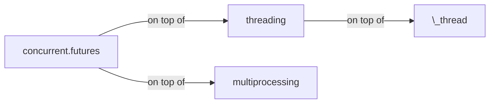

---
authors:
- copdips
categories:
- python
- async
comments: true
date:
  created: 2021-09-04
description: ''
---

# Python Asyncio Study notes

## concurrent.futures

The [concurrent.futures](https://docs.python.org/3.9/library/concurrent.futures.html) is a high-level abstraction for the `threading` and `multiprocessing` modules.

