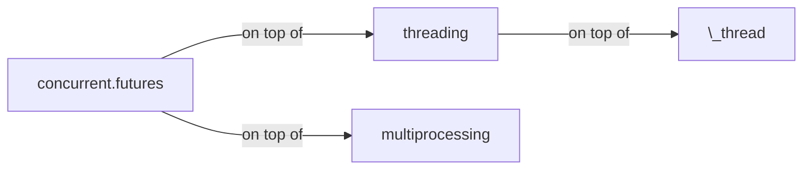

---
authors:
- copdips
categories:
- python
- async
- multiprocessing
comments: true
date:
  created: 2023-09-14
  updated: 2024-10-26
description: ''
---

# Python Asyncio

!!! note

    This is not a Python asyncio tutorial. Just some personal quick tips here, and could be updated from time to time.

<!-- more -->

## Asyncio Cheat Sheet from SuperFastPython

https://marvelous-writer-6152.ck.page/d29b7d8dfb

## concurrent.futures

The [concurrent.futures](https://docs.python.org/3.9/library/concurrent.futures.html) is a high-level abstraction for the `threading` and `multiprocessing` modules.



## greenlet vs gevent

- greenlet needs manual event switch.
- gevent is based on greenlet. gevent has `gevent.monkey.patch_all()`.

## @asyncio.coroutine

From Python 3.8, `async def` deprecates `@asyncio.coroutine`

## yield from

From Python 3.5, `await` deprecates `yield from`

## scope of await

`await` can only be used in `async def` except in `ipython`

## asyncio with queue

<https://copdips.com/2023/01/python-aiohttp-rate-limit.html#example>

## aiohttp with rate limit

<https://copdips.com/2023/01/python-aiohttp-rate-limit.html#example>

## get_running_loop vs get_event_loop

- `get_running_loop` raises error if there's no running loop.
- `get_event_loop` return running loop if exists, otherwise create one and return it.

## Awaitable vs Future vs Task vs coroutine

- [`Awaitable`](https://docs.python.org/3/library/asyncio-task.html#awaitables) is an object can be used in an `await` expression. There are three main types of awaitable objects: `coroutines`, `Tasks`, and `Futures`.
- [`coroutine`](https://docs.python.org/3/library/asyncio-task.html#coroutine) is declared with the `async/await` syntax is the preferred way of writing asyncio applications. Coroutines can await on `Future` objects until they either have a result or an exception set, or until they are cancelled. Python coroutines are awaitables and therefore can be awaited from other coroutines
- [`Future`](https://docs.python.org/3/library/asyncio-future.html#asyncio.Future) is an awaitable object. A Future represents an eventual result of an asynchronous operation. Not thread-safe.
- [`Task`](https://docs.python.org/3/library/asyncio-task.html#asyncio.Task) is subclass of `Future` that runs a Python coroutine. Not thread-safe. Tasks are used to schedule coroutines concurrently. When a coroutine is wrapped into a Task with functions like `asyncio.create_task()` the coroutine is automatically scheduled to run soon

> <https://docs.python.org/3/library/asyncio-task.html#task-object>: Tasks are used to run coroutines in event loops. If a coroutine awaits on a Future, the Task suspends the execution of the coroutine and waits for the completion of the Future. When the Future is done, the execution of the wrapped coroutine resumes. Event loops use cooperative scheduling: an event loop runs one Task at a time. While a Task awaits for the completion of a Future, the event loop runs other Tasks, callbacks, or performs IO operations.

## ensure_future vs create_task

- `create_task` is high-level introduced in Python 3.7 and accepts only `coroutines`, returns a Task object which is subclass of Future. `create_task` must be called inside a running event loop.
- `ensure_future` is low-level and accepts both `coroutines` and `Futures`. `Task` is subclass of `Future`. If `ensure_future` gets a `Task`, it will return the input `Task` itself, as Future is ensured. If `ensure_future` gets a `coroutine`, it will call `create_task` to wrap the input `coroutine` to a `Task`, then return it.
- `create_task` must be called inside an event loop, `ensure_future` can create an event loop if not exists.
- `create_task` can name the task.

create_task [source code](https://github.com/python/cpython/blob/124af17b6e49f0f22fbe646fb57800393235d704/Lib/asyncio/tasks.py#L369-L382), ensure_future [source code](https://github.com/python/cpython/blob/124af17b6e49f0f22fbe646fb57800393235d704/Lib/asyncio/tasks.py#L647-L652).

[Warning on ensure_future](https://docs.python.org/3/library/asyncio-future.html#asyncio.ensure_future):
!!! warning

    Deprecated since version 3.10: Deprecation warning is emitted if obj is not a Future-like object and loop is not specified and **there is no running event loop**. Coroutine is not a Future-like object.

## await vs await asyncio.wait_for() vs asyncio.shield()

Almost the same. but wait_for() can set timeout, and shield() can protect a task from being cancelled.

```py
await task

# throw TimeoutError if timeout
await asyncio.wait_for(task, timeout)

# still throw TimeoutError if timeout, but task.cancelled()
# inside of try/catch asyncio.TimeoutError block will be ignored, a
# nd task continues to run.
await asyncio.wait_for(asyncio.shield(task), 1)
```

```py
import asyncio

async def delay(seconds):
    print(f"start sleep {seconds}")
    await asyncio.sleep(seconds)
    print(f"end sleep")
    return seconds

async def main():
    delay_task = asyncio.create_task(delay(2))
    try:
        result = await asyncio.wait_for(asyncio.shield(delay_task), 1)
        print("return value:", result)
    except asyncio.TimeoutError:
        # shield() does not protect from timeout, so it throws TimeoutError
        print("timeout")
        # shield() does protect from being cancelled
        print("whether the task is cancelled:", delay_task.cancelled())
        # from where it throws TimeoutError, continue to run, and wait for it to finish
        result = await delay_task
        print("return value:", result)

asyncio.run(main())

"""
start sleep 2
timeout
whether the task is cancelled: False
end sleep
return value: 2
"""
```

## simple aiohttp download demo

```python
import asyncio
import os

import aiohttp


async def download_img(session, url):
    file_name = os.path.basename(url)
    print(f"Downloading：{file_name}")
    response = await session.get(url, ssl=False)
    content = await response.content.read()
    with open(file_name, mode="wb") as file:
        file.write(content)
    print(f"Done：{file_name}")


async def main():
    urls = [
        "https://tenfei05.cfp.cn/creative/vcg/800/new/VCG41560336195.jpg",
        "https://tenfei03.cfp.cn/creative/vcg/800/new/VCG41688057449.jpg",
    ]
    async with aiohttp.ClientSession() as session:
        # download_img(session, url) returns a coroutine
        tasks = [asyncio.create_task(download_img(session, url)) for url in urls]
        await asyncio.wait(tasks)


# loop = asyncio.get_event_loop()
# loop.run_until_complete(main())

# above commented 2 lines are low level API and could be replaced by
# below asyncio.run() introduced by python 3.7.
# asyncio.get_event_loop() creates new event loop if doesn't exist.
# asyncio.run() raises exception if already in a event loop.
# This function always creates a new event loop and closes it at the end.
# It should be used as a main entry point for asyncio programs, and should
# ideally only be called once.
asyncio.run(main())
```

## aiohttp rate limit example

<https://copdips.com/2023/01/python-aiohttp-rate-limit.html>

## run coroutines concurrently as asyncio Tasks

await coroutines directly will run the coroutines sequentially, so 2 sleeps of 2s takes 4s:

```python
import asyncio
import time

print(f"started at {time.strftime('%X')}")
await asyncio.sleep(2)
await asyncio.sleep(2)
print(f"started at {time.strftime('%X')}")

# output, duration 4s
started at 23:48:19
started at 23:48:23
```

Wrap the coroutines into tasks to run concurrently, 2 sleeps of 2s takes 2s:

```python
import asyncio
import time

print(f"started at {time.strftime('%X')}")

# create_task() must be inside a running event loop,
# often created by asyncio.run()
task1 = asyncio.create_task(asyncio.sleep(2))
task2 = asyncio.create_task(asyncio.sleep(2))

await task1
await task2
# or: await asyncio.wait([task1, task2])

print(f"started at {time.strftime('%X')}")

# output, duration 2s
started at 23:49:08
started at 23:49:10
```

## schedule task without asyncio.create_task

The popular asyncio tasks usage is :

```python
import asyncio
import time

async def main()
    start = time.time()
    tasks = [
        asyncio.create_task(asyncio.sleep(2)),
        asyncio.create_task(asyncio.sleep(2)),
    ]
    await asyncio.wait(tasks)
    print(time.time() - start)

asyncio.run(main())

# output
2.0010249614715576
```

`asyncio.create_task()` must be run inside a event loop, which is created by `asyncio.run()`. We can also not use `asyncio.create_task()` to create tasks too:

```python
import asyncio
import time


coroutines = [
    # Without asyncio.create_task(), the coroutines are not scheduled,
    # there's even no event loop.
    # If use asyncio.create_task(), the coroutines are scheduled,
    # and run concurrently right now, but must be run in a running event loop.
    asyncio.sleep(2),
    asyncio.sleep(2)
]

start = time.time()

# asyncio.run() creates an event loop,
# then asyncio.wait() wraps the coroutines into tasks, and start them.
asyncio.run(asyncio.wait(coroutines))

print(time.time() - start)

# output
2.0026962757110596
```

## wait vs gather vs as_completed vs TaskGroup

- [`wait`](https://docs.python.org/3/library/asyncio-task.html#asyncio.wait) is a low-level api, [`gather`](https://docs.python.org/3/library/asyncio-task.html#asyncio.gather) is a high-level api.
- `wait` has more options than `gather`:
    - `async def wait(fs, *, loop=None, timeout=None, return_when=ALL_COMPLETED):`
    - `def gather(*coros_or_futures, loop=None, return_exceptions=False):`
- `wait` accepts lists of coroutines/Futures (`asyncio.wait(tasks)`), `gather` accepts each element a coroutine/Futures (`asyncio.gather(*tasks)`).
- `wait` returns two `futures` in a tuple: `(done, pending)`, it's a coroutine `async def`. To get the `wait` results: `[d.result() for d in done]`, `gather` returns the results directly, it's a standard `def`.
- `gather` can group tasks, and can also cancel groups of tasks.
- `as_completed` returns an traditional iterator (not async inter for Python prior to 3.13, see below note), and is used to iterate over the tasks as they are completed. It's a generator, and returns the results **in the order they are completed**.

    !!! note "New in Python3.13: as_completed works with async for instead of for"
        Since [Python3.13](https://docs.python.org/3.13/library/asyncio-task.html#asyncio.as_completed), `async for` should be used with `as_completed` instead of `for`.
        And it returns the completed task in `Task` object instead of `coroutine` object.

        So now, we can use `completed_task.get_name()`, `completed_task.result()`, `completed_task.exception()` directly.

        Check this [StackOverflow answer](https://stackoverflow.com/a/79125969/5095636) for more details.

- [`TaskGroup`](https://docs.python.org/3/library/asyncio-task.html#asyncio.TaskGroup): Added in [Python 3.11](https://docs.python.org/3/whatsnew/3.11.html#asyncio), an asynchronous context manager holding a group of tasks that will wait for all of them upon exit. For new code this is ===recommended over using create_task() and gather() directly===. (Contributed by Yury Selivanov and others in gh-90908.)

    ```python title="gather"
    async def main():
        group1 = asyncio.gather(f1(), f1())
        group2 = asyncio.gather(f2(), f2())
        group1.cancel()
        # if return_exceptions=False, `asyncio.exceptions.CancelledError` will be raised,
        # if return_exceptions=True, the exception will be returned in the results.
        # return_exceptions default value is False
        all_groups = await asyncio.gather(group1, group2, return_exceptions=True)
        print(all_groups)
    ```

    ```python title="TaskGroup since Python 3.11"
    async def main():
        async with asyncio.TaskGroup() as tg:
            task1 = tg.create_task(some_coro(...))
            task2 = tg.create_task(another_coro(...))
        print(f"Both tasks have completed now: {task1.result()}, {task2.result()}")
    ```

    ```python title="TaskGroup is recommended over create_task() and gather()"
    # create_task() and gather() example:
    tasks = [asyncio.create_task(task(i)) for i in range(10)]
    await asyncio.gather(*tasks)

    # TaskGroup example:
    async with asyncio.TaskGroup() as group:
        for i in range(10):
            _ = group.create_task(task(i))
    ```

- If the `wait` task is cancelled, it simply throws an CancelledError and the waited tasks remain intact. Need to call `task.cancel()` to cancel the remaining tasks. If `gather` is cancelled, all submitted awaitables (that have not completed yet) are also cancelled. <https://stackoverflow.com/a/64370162>

## task.add_done_callback

```python
import asyncio
from asyncio import Future
from functools import partial


async def f1():
    await asyncio.sleep(2)
    return "f1"


def callback1(future: Future):
    print(future.result())
    print("this is callback1")


def callback2(t1, future: Future):
    print(t1)
    print(future.result())


async def main():

    task1 = asyncio.create_task(f1())

    # bind callback1 to task1
    task1.add_done_callback(callback1)

    # bind callback2 to task2 with param
    task1.add_done_callback(partial(callback2, "this is param t1"))

    # await task1
    tasks = [task1]
    await asyncio.wait(tasks)


asyncio.run(main())
```

## run_until_complete vs run_forever

`run_until_complete` is `run_forever` with `_run_until_complete_cb` as callback.

```python
def _run_until_complete_cb(fut):
    if not fut.cancelled():
        exc = fut.exception()
        if isinstance(exc, (SystemExit, KeyboardInterrupt)):
            # Issue #22429: run_forever() already finished, no need to
            # stop it.
            return
    futures._get_loop(fut).stop()
```

## run_in_executor (or to_thread) to run un-asyncable functions

`to_thread()` calls `loop = events.get_running_loop()` and `loop.run_in_executor()` internally, source code [here](https://github.com/python/cpython/blob/d7dc3d9455de93310ccde13ceafe84d426790a5c/Lib/asyncio/threads.py#L25):

```python
import asyncio
import time
from concurrent.futures import ThreadPoolExecutor


# non asyncable function, will be wrapped into async task by loop.run_in_executor()
def download_img(url):
    print(f"Downloading：{url}")
    time.sleep(1)
    print(f"Downloaded：{url}")


async def main():
    executor = ThreadPoolExecutor(2)

    loop = asyncio.get_running_loop()
    tasks = []
    for i in range(10):
        # ThreadPoolExecutor is also the default executor, set None to use it.
        # t = loop.run_in_executor(None, download_img, i)
        t = loop.run_in_executor(executor, download_img, i)
        tasks.append(t)

    await asyncio.wait(tasks)


asyncio.run(main())
```

`run_in_executor()` calls [`ThreadPoolExecutor` by default], and can also use `ProcessPoolExecutor`, source code [here](https://github.com/python/cpython/blob/d7dc3d9455de93310ccde13ceafe84d426790a5c/Lib/asyncio/base_events.py#L835):

```python
# asyncio.base_events.py
def run_in_executor(self, executor, func, *args):
    self._check_closed()
    if self._debug:
        self._check_callback(func, 'run_in_executor')
    if executor is None:
        executor = self._default_executor
        # Only check when the default executor is being used
        self._check_default_executor()
        if executor is None:
            executor = concurrent.futures.ThreadPoolExecutor(
                thread_name_prefix='asyncio'
            )
            self._default_executor = executor
    return futures.wrap_future(
        executor.submit(func, *args), loop=self)
```

## Debug mode

When setting env var [PYTHONASYNCIODEBUG](https://docs.python.org/3/using/cmdline.html#envvar-PYTHONASYNCIODEBUG) to any non-empty string, you can enable [asyncio debug mode](https://docs.python.org/3/library/asyncio-dev.html#debug-mode), which provides additional output for debugging purpose.

For example, when using aiohttp's `ClientSession` without `async with` context manager, it's important to manually call `await session.close()` to avoid unclosed session errors. Of you forget to do so, you'll typically receive a simple error message without much details. However, with asyncio debug mode enabled, the error message will include a [traceback](https://github.com/aio-libs/aiohttp/blob/e5e521e2aa1923223abd680bb431dc21c2c9c863/aiohttp/client.py#L335-L337) that pinpoints the unclosed session creation point, greatly simplifying the troubleshooting.

## asyncio inside multiprocessing

```python
import asyncio
import concurrent.futures
import logging
from functools import partial


async def single_async_func(sleep_time: float, logger: logging.Logger):
    await asyncio.sleep(sleep_time)
    logger.info(f"Slept for {sleep_time} seconds")


async def async_func_entrypoint(sleep_time: float, logger: logging.Logger):
    tasks = [
        asyncio.create_task(single_async_func(sleep_time, logger)) for _ in range(3)
    ]
    errors: list[Exception] = []
    for completed_task in asyncio.as_completed(tasks):
        try:
            _ = await completed_task
        except Exception as ex:
            # we collect all the errors raised by each async task instead of
            # letting them to raise up to async_wrapper,
            # this will allow other tasks to continue.
            errors.append(ex)
            logger.exception(f"Error: {ex}")
    return errors


def async_wrapper(
    sleep_time: float,
    logger: logging.Logger,
):
    try:
        return asyncio.run(async_func_entrypoint(sleep_time=sleep_time, logger=logger))
    except Exception as ex:
        msg = f"Error: {ex}"
        logger.exception(msg)
        return 0
    finally:
        # ! MUST flush logs if OpenTelemetry like logs are used
        for handler in logger.handlers:
            handler.flush()


def main():
    logging.basicConfig(level=logging.INFO)
    logger = logging.getLogger(__name__)
    sleep_times = list(range(10))
    # https://docs.python.org/3/library/concurrent.futures.html#processpoolexecutor-example
    with concurrent.futures.ProcessPoolExecutor() as executor:
        func = partial(async_wrapper, logger=logger)
        for sleep_time, ret in zip(sleep_times, executor.map(func, sleep_times)):
            logger.info(f"sleep_time: {sleep_time}, got return: {ret}")


if __name__ == "__main__":
    main()
```
