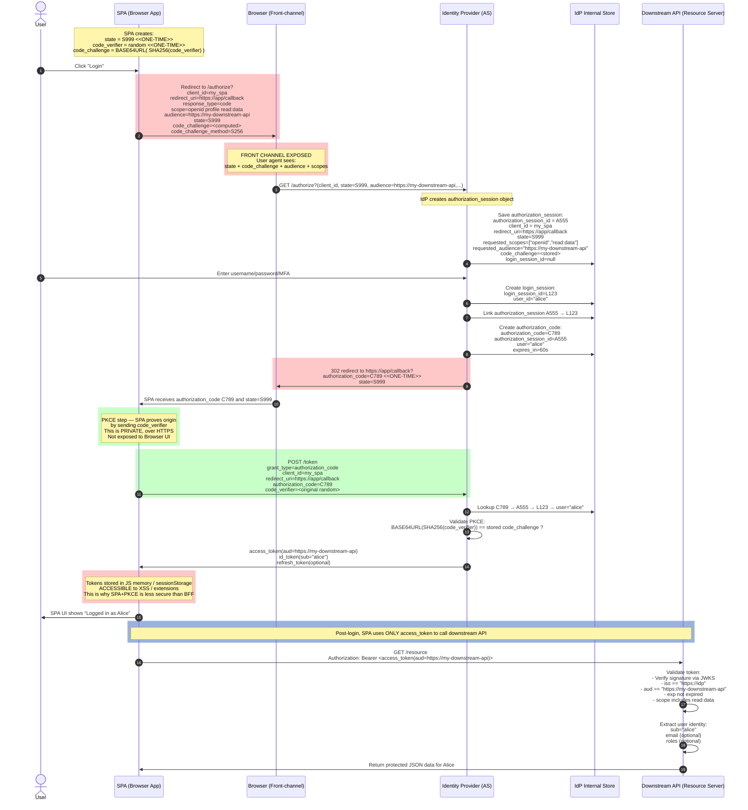

---
authors:
- copdips
categories:
- auth
- frontend
- web
comments: true
date:
    created: 2025-11-18
---

# OIDC (openid connect)

[OIDC (OpenID Connect)](https://openid.net/connect/) is an **authentication layer** built on top of the OAuth 2.0 protocol (**authorization layer**). It allows Web-based, mobile, and JavaScript clients to verify the identity of end-users based on the authentication performed by an authorization server (aka AS or IdP), as well as to obtain basic profile information about the end-user in an interoperable and REST-like manner. It eliminates storing and managing people's passwords.

<!-- more -->

## OIDC Flows

Some flows (e.g. Implicit Flow, Password Grant (ROPC), without PKCE) have already been deprecated, below are the recommended flows in 2025:

| Flow                                                  | Purpose                  | Notes                           |
| ----------------------------------------------------- | ------------------------ | ------------------------------- |
| Authorization Code Flow (Confidential Client)  | Web backends / BFF       | Uses client_secret              |
| Authorization Code Flow + PKCE (Public Client) | SPA, native apps, desktop, mobile | No client_secret, uses PKCE     |
| Client Credentials Flow                        | Machine-to-machine       | No user involved                |
| Device Authorization Flow (Device Code)        | TVs, CLI apps, IoT       | User logs in on separate device.<br/>Useful when no browser available or with limited input capabilities.<br/>e.g. <https://microsoft.com/devicelogin> |

### Authorization Code Flow + PKCE (Public Client) for SPA

This flow works for a single audience (the Downstream API). In some cases, the SPA itself may act as the resource server (e.g., when using FastAPI's auto-generated OpenAPI UI), meaning the audience would be the API backend itself rather than a separate downstream service.

The access token is saved in user's browser's memory (e.g., JavaScript variable, sessionStorage) and is accessible to JavaScript code running in the browser, including potentially malicious scripts injected via XSS vulnerabilities or browser extensions. Therefore, it's crucial to implement robust security measures to protect against XSS attacks when using this flow.



### OIDC Authorization Code Flow (Confidential Client) with BFF pattern and Session Cookies

In **BFF (Backend For Frontend)** pattern , **OIDC** is used for initial authentication and obtaining user identity, then **session cookies** are used to maintain the authenticated state within the application.

BFF often employs this combination. This is widely considered the most secure and robust pattern for modern web applications. BFF handles the complex OIDC token flows and securely translates them into a simple, traditional session cookie for the browser. This approach offers several advantages:

- **performance**: avoid sending large 2-4KB JWT on every request, but with ~100 byte cookie.
- **simplicity**: frontend just needs to include a cookie with its requests, just like in the old days, and doesn't need to manage token refreshing or storage.

!!! note "BFF is considered as a more secure approach compared to SPA+PKCE"
    As tokens are never exposed to the browser environment, reducing the risk of token theft via XSS attacks.
    But BFF itself must implement all the measures to prevent Cross-Site Request Forgery (CSRF) attacks.
    And the SPA must be hosted by the BFF backend due to SameSite cookie for CSRF, which is implemented as a regular web application.

Once the user is authenticated, the BFF can use multiple methods to obtain access tokens for different downstream APIs:

| Method                         | Used For                       | User Context Provided Directly? | Multi-API   | Refresh Token Needed |
| ------------------------------ | ------------------------------ | ------------------------------- | ----------- | -------------------- |
| **Refresh Token**              | Standard BFF                   | ✔ Yes (from IdP, with BFF's access token)                | ✔ Excellent | ✔ Yes                |
| **Token Exchange (RFC 8693)**  | Best modern multi-API          | ✔ Yes (delegated, act on behalf of the user)               | ✔✔✔ Best    | ❌ No                 |
| **Client Credentials**         | Machine-to-Machine             | ❌ No                            | ✔ OK        | ❌ No                 |
| **JWT Bearer Assertion**       | Server identity                | Optional (if user included)     | ✔ Yes       | ❌ No                 |
| **mTLS (with X.509 certificates)**                       | High security internal systems | ❌ No           | ✔ Yes       | ❌ No                 |
| **API Keys**                   | Same as mTLS but with API key<br/>Legacy / simple                | ❌ No                            | ✔ OK        | ❌ No                 |
| **Internal Headers / Cookies** | Service mesh                   | Optional (propagated)           | ✔ Yes       | ❌ No                 |

Below is an example sequence diagram illustrating the OIDC Authorization Code Flow with BFF pattern and session cookies, including the use of refresh tokens to obtain access tokens for multiple downstream APIs.

```mermaid title="OIDC Authorization Code Flow with BFF pattern and with refresh token for multiple Downstream APIs"
sequenceDiagram
    autonumber
    actor User as User
    participant Swagger as Swagger UI<br/>(or any web page with Login)
    participant Browser as Browser

    %% NEW ENTITY ADDED HERE
    participant BFFStore as BFF Session Store<br/>(Redis / DB)

    participant BFF as API Backend (BFF)<br/><br/>https://api<br/>client_id=my_bff
    participant IdP as Identity Provider<br/><br/>https://idp
    participant Store as IdP / BFF Store
    participant API1 as Downstream API 1<br/>https://api-1
    participant API2 as Downstream API 2<br/>https://api-2

    %% ============================================================
    %% STEP 0 — LOGIN CLICK (BFF ENTRY POINT)
    %% ============================================================
    User ->> Swagger: Click "Authorize"
    Swagger ->> BFF: GET /login

    %% STEP 1 — BFF CREATES STATE + PRE-SESSION
    Note over BFF: Generate:<br/>state=S555<br/>nonce=N777<br/>pre_session=P222<br/>Store {state, nonce}
    BFF ->> BFFStore: Save pre_session P222

    %% FRONT-CHANNEL REDIRECT TO IdP
    BFF ->> Browser: 302 Location: https://idp/authorize?<br/>client_id=my_bff<br/>redirect_uri=https://api/callback<br/>response_type=code<br/>scope=openid offline_access profile<br/>state=S555<br/>nonce=N777

    rect rgb(255,200,200)
    Note over Browser: FRONT CHANNEL<br/>Query params visible to user agent
    end

    Browser ->> IdP: GET /authorize?(client_id, state=S555, ...)

    %% ============================================================
    %% STEP 2 — IdP CREATES AUTHORIZATION + LOGIN SESSIONS
    %% ============================================================
    Note over IdP: Create authorization_session A111<br/>for client my_bff, state S555
    IdP ->> Store: Save authorization_session A111

    User ->> IdP: Login (pwd / MFA)
    Note over IdP: Create login_session L888<br/>user_id="alice"
    IdP ->> Store: Save login_session L888
    IdP ->> Store: Link A111 → L888

    %% ============================================================
    %% STEP 3 — IdP RETURNS AUTHORIZATION CODE TO BFF (VIA BROWSER)
    %% ============================================================
    Note over IdP: Create authorization_code C444<br/>linked to A111, user="alice"

    rect rgb(255,200,200)
    IdP ->> Browser: 302 https://api/callback?<br/>code=C444<br/>state=S555
    end

    Browser ->> BFF: GET /callback?<br/>code=C444<br/>state=S555

    %% STEP 4 — BFF VALIDATES STATE
    Note over BFF: Lookup pre_session P222<br/>Check state=S555 OK
    BFF ->> BFFStore: Load pre_session P222

    %% ============================================================
    %% STEP 5 — BFF EXCHANGES CODE FOR TOKENS (BACK-CHANNEL)
    %% ============================================================
    Note over BFF: BFF is a confidential client<br/>uses client_secret, no PKCE needed
    BFF ->> IdP: POST /token<br/>{<br/>"grant_type":"authorization_code",<br/>"client_id":"my_bff",<br/>"client_secret":"SECRET",<br/>"code":"C444",<br/>"redirect_uri":"https://api/callback"<br/>}

    Note over IdP: Resolve C444 → A111 → L888 → user="alice"
    IdP ->> BFF: {<br/>"id_token": "...",<br/>"access_token": "...",  // default audience<br/>"refresh_token": "R777",<br/>"token_type": "Bearer",<br/>"expires_in": 3600<br/>}

    %% STEP 6 — BFF CREATES SERVER-SIDE SESSION
    Note over BFF: Create session_id=S333<br/>Store in shared store:<br/>session:S333 → {<br/>user:"alice",<br/>id_token:"...",<br/>refresh_token:"R777",<br/>tokens:{}<br/>}
    BFF ->> BFFStore: Save session S333

    BFF ->> Browser: Set-Cookie: session_id=S333<br/>HttpOnly<br/>Secure<br/>SameSite=Lax

    %% STEP 7 — AUTHENTICATED SWAGGER / PORTAL
    Browser ->> BFF: GET /docs<br/>Cookie: session_id=S333
    BFF ->> BFFStore: Load session S333
    BFF ->> Swagger: Render authenticated UI<br/>("Authorized" lock)

    %% ============================================================
    %% POST-AUTH — SPA/Swagger CALLS API #1 VIA BFF
    %% ============================================================

    rect rgba(153, 179, 219, 1)
    Note over Browser,API2: post-login operational sequence, BFF handles tokens to API-1 and API-2, browser only sends session cookie
    end

    Note over Browser,BFF: Browser NEVER sees tokens<br/>Only sends small session_id cookie
    Browser ->> BFF: GET /api1/data<br/>Cookie: session_id=S333

    %% BFF LOOKUP SESSION + TOKEN FOR API1
    BFF ->> BFFStore: Load session S333
    Note over BFF: Load refresh_token R777<br/>Check if access_token for API1 exists and valid

    alt No valid token for API1 yet
        Note over BFF,IdP: Use refresh_token to mint access_token for API1
        BFF ->> IdP: POST /token<br/>{<br/>"grant_type":"refresh_token",<br/>"client_id":"my_bff",<br/>"client_secret":"SECRET",<br/>"refresh_token":"R777",<br/>"audience":"https://api-1"<br/>}
        IdP ->> BFF: {<br/>"access_token":"AT_API1",<br/>"expires_in":3600,<br/>"refresh_token":"R888" (optional rotated)<br/>}

        Note over BFF: Store in session:<br/>tokens["https://api-1"].access_token = AT_API1<br/>If new refresh_token R888 → update
        BFF ->> BFFStore: Save session S333
    end

    %% BFF → API1 WITH ACCESS TOKEN
    BFF ->> API1: GET /resource<br/>Authorization: Bearer AT_API1
    API1 ->> API1: Validate JWT:<br/>iss, aud="https://api-1", exp, scopes
    API1 ->> BFF: JSON data
    BFF ->> Browser: JSON data

    %% ============================================================
    %% POST-AUTH — SPA/Swagger CALLS API #2 VIA BFF
    %% ============================================================
    Browser ->> BFF: GET /api2/data<br/>Cookie: session_id=S333

    BFF ->> BFFStore: Load session S333
    Note over BFF: Load refresh_token<br/>Check if access_token for API2 exists and valid

    alt No valid token for API2 yet
        Note over BFF,IdP: Use SAME refresh_token to mint<br/>access_token for new audience
        BFF ->> IdP: POST /token<br/>{<br/>"grant_type":"refresh_token",<br/>"client_id":"my_bff",<br/>"client_secret":"SECRET",<br/>"refresh_token":"Rxxx",<br/>"audience":"https://api-2"<br/>}
        IdP ->> BFF: {<br/>"access_token":"AT_API2",<br/>"expires_in":3600,<br/>"refresh_token":"Ryyy" (optional rotated)<br/>}

        Note over BFF: Store in session:<br/>tokens["https://api-2"].access_token = AT_API2<br/>Update refresh_token if rotated
        BFF ->> BFFStore: Save session S333
    end

    BFF ->> API2: GET /resource<br/>Authorization: Bearer AT_API2
    API2 ->> API2: Validate JWT:<br/>iss, aud="https://api-2", exp, scopes
    API2 ->> BFF: JSON data
    BFF ->> Browser: JSON data
```

## FAQ

### OIDC vs OpenID vs OpenID 2.0

- **OpenID and OpenID 2.0** (based on XML) are both deprecated.

- **OIDC** is the modern standard driven by the same foundation, which is based on OAuth2 with JWT.

### OIDC vs SAML

- **SAML** (Security Assertion Markup Language) is an older standard in **XML** for single sign-on (SSO) and identity federation, primarily used in enterprise environments, and **only for web-based applications**.

- **OIDC** is a more modern protocol in **JSON/REST** that is easier to implement and is designed for **web and mobile applications**.

### OIDC vs OAuth2

[OpenID Connect FAQ](https://openid.net/developers/how-connect-works/) states:

> OAuth 2.0, is a framework, specified by the IETF in RFCs 6749 and 6750 (published in 2012) designed to support the development of authentication and authorization protocols. It provides a variety of standardized message flows based on JSON and HTTP; OpenID Connect uses these to provide Identity services.

While the statement mentions that OAuth 2.0 supports both authentication and authorization protocols, **OAuth 2.0 is fundamentally an authorization framework**. It answers "**what can this application do?**" by issuing `access_token`s that grant access to protected resources.

**OIDC extends OAuth 2.0 to add standardized authentication** by introducing the `id_token`. This token directly answers "**who is this user?**" with verified identity claims like name, email, and a unique identifier.

However, it's worth noting that even with pure OAuth 2.0, applications can achieve a form of authentication indirectly: the `access_token` can be used to call an API endpoint (such as `/userinfo`, for e.g. <https://graph.microsoft.com/oidc/userinfo>) on the resource server to retrieve basic user profile information. By obtaining this data, the application can identify the user, match them against its own user database, and establish a local session. But this approach is not standardized and relies on application-specific implementation, which is precisely the gap that OIDC fills with its formal authentication layer.

### OIDC vs session cookies

Session cookies are simpler for single-application scenarios, while OIDC is better suited for distributed systems, microservices, and multi-application environments where centralized authentication and SSO are needed.

- **Session cookies** are a traditional authentication mechanism where the server creates a session after successful login and sends a session ID to the client as a cookie. The client includes this cookie in subsequent requests to maintain the authenticated state. This approach is **tightly coupled** to the server that created the session and requires **server-side session storage**.

- **OIDC** is a **stateless, distributed-friendly authentication protocol** that uses tokens (ID token, access token) instead of server-side sessions. Tokens are **self-contained** (especially JWTs), can be **verified independently** without server state, and enable **single sign-on (SSO)** across multiple applications. OIDC separates the authentication provider (IdP) from the application, allowing **centralized identity management**.

- **Session cookies + OIDC** also known as [BFF (Backend For Frontend)](#oidc-authorization-code-flow-confidential-client-with-bff-pattern-and-session-cookies), is a common pattern: OIDC is used for initial authentication and obtaining user identity, then session cookies are used to maintain the authenticated state within the application for **performance** (avoid sending large 2-4KB JWT on every request, but with ~100 byte cookie) and **simplicity** (frontend just needs to include a cookie with its requests, just like in the old days, and doesn't need to manage token refreshing or storage). **BFF (Backend For Frontend) pattern** often employs this combination. This is widely considered the most secure and robust pattern for modern web applications. BFF handles the complex OIDC token flows and securely translates them into a simple, traditional session cookie for the browser.

  ```mermaid title="Session cookie + OIDC hybrid (BFF pattern) with FastAPI and Azure Entra"
  sequenceDiagram
      participant Browser
      participant BFF as BFF (FastAPI)
      participant IdP as Azure Entra
      participant API as Downstream API

      Note over Browser,API: Initial Authentication
      Browser->>BFF: GET /login
      BFF->>Browser: Redirect to Azure Entra
      Browser->>IdP: Authorization request
      IdP->>Browser: Login page
      Browser->>IdP: Credentials
      IdP->>Browser: Redirect with auth code
      Browser->>BFF: GET /callback?code=xxx
      BFF->>IdP: Exchange code for tokens
      IdP->>BFF: id_token + access_token (JWT ~3KB)
      BFF->>BFF: Create session, store tokens
      BFF->>Browser: Set-Cookie: session_id=abc (~100B)

      Note over Browser,API: Subsequent Requests (Performance Win)
      Browser->>BFF: GET /api/data<br/>Cookie: session_id=abc (~100B)
      BFF->>BFF: Validate session
      BFF->>API: GET /resource<br/>Authorization: Bearer JWT (~3KB)
      API->>BFF: Response data
      BFF->>Browser: Response data

      Note over Browser,BFF: Multiple frontend requests = tiny cookies
      Note over BFF,API: Selective backend calls = JWTs only when needed
  ```
