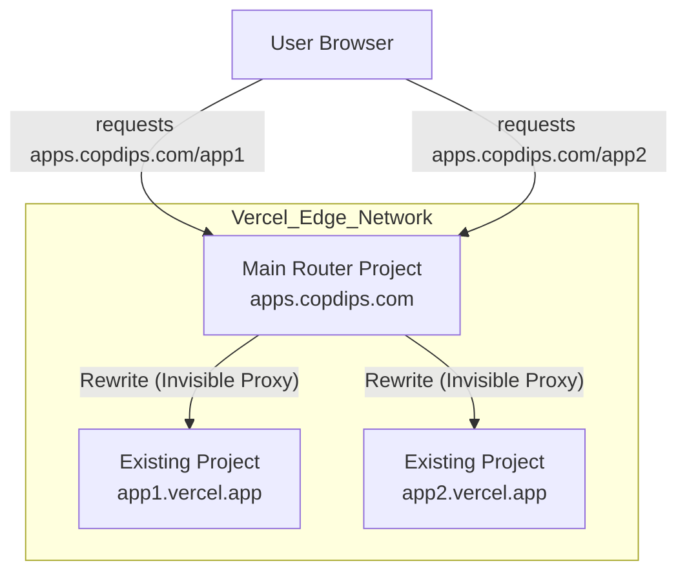

---
authors:
- copdips
categories:
- frontend
- web
comments: true
date:
    created: 2025-12-06
---

# Running Multiple Apps Under a Single Domain with Vercel

I own the `copdips.com` domain, and need to point it at several Vercel apps so that:

* https://apps.copdips.com/app1 routes to https://app1.vercel.app
* https://apps.copdips.com/app2 routes to https://app2.vercel.app
* direct https://app1.vercel.app, still works as before
* direct https://app2.vercel.app, still works as before

This is a standard **Multi-Tenant Routing with Context Awareness** scenario. To serve both the root domain (`app1.vercel.app`) and the subpath version (`apps.copdips.com/app1`) from the same deployment, each app must become host-aware-effectively detecting whether the request comes through the main router or directly and adjusting asset URLs and links accordingly.

<!-- more -->

In case of redirect, if `app1.vercel.app` serves an HTML file that contains `<link href="/styles.css">`, the browser should load `apps.copdips.com/app1/styles.css`, but not  `apps.copdips.com/styles.css` (the root).



## The Problem

When accessing `apps.copdips.com/app1/`, absolute paths like `/assets/style.css` resolve to `apps.copdips.com/assets/style.css` instead of `apps.copdips.com/app1/assets/style.css`. Result? 404 errors and broken navigation.

## The Solution

### Child Vercel App

1. Fix Asset Paths with Vite

    Add one line to `vite.config.ts`:

    ```typescript title="vite.config.ts in Child App"
    export default defineConfig({
      plugins: [react()],
      base: './', // ⭐️ This makes all asset paths relative
    });
    ```

2. Fix Navigation with Dynamic Basename (React Router Only)

    **Only needed if your child app uses `react-router-dom`.** Your router needs to know it might be running under a subpath (`/my-app-name`) OR at the root (`/`).

    Dynamically set the basename in your Router:

    ```tsx title="App.tsx in Child App"
    import { BrowserRouter } from 'react-router-dom';

    const App = () => {
      const getBasename = () => {
        const path = window.location.pathname;
        if (path.startsWith('/my-app-name')) return '/my-app-name';
        return '/'; // Direct access (my-app.vercel.app)
      };

      return (
        <BrowserRouter basename={getBasename()}>
          {/* Your routes here */}
        </BrowserRouter>
      );
    };
    ```

    Now `<Link to="/about">` works correctly in both environments.

### Router Part

On the main domain (`apps.copdips.com`), configure `vercel.json`:

1. For React/SPA Apps

    ```json title="vercel.json in Router App"
    {
      "trailingSlash": true,
      "rewrites": [
        { "source": "/app1/:path*", "destination": "https://app1.vercel.app/:path*" }
      ],
      "redirects": [
        { "source": "/app1", "destination": "/app1/", "permanent": true }
      ]
    }
    ```

2. For MkDocs Apps

    ??? tip "Setting up MkDocs for Vercel"
        MkDocs projects run smoothly on Vercel too. For a reference implementation, check [fu-sen/Vercel-MkDocs](https://github.com/fu-sen/Vercel-MkDocs). The idea is simple: compile the static site so the output lives under `public/`, and Vercel serves that directory automatically.

        Core steps:

        1. in `package.json`, add a build script to build MkDocs site into `public/` in Vercel:
            ```json title="package.json in MkDocs App" hl_lines="7"
            {
              "name": "mkdocs",
              "version": "1.0.0",
              "private": true,
              "scripts": {
                "dev": "mkdocs serve",
                "build": "python3 -m mkdocs build -d public"
              }
            }
            ```
        2. Add `requirements.txt` to root with all the mkdocs python dependencies. Vercel will auto-install them.
        3. In Vercel project settings, set **Framework Preset** to **Other** and keep the remaining options at their defaults.

    When `use_directory_urls: true` is enabled in `mkdocs.yml` (so `.html` extensions stay hidden), add explicit `index.html` rewrites as shown below:

    ```json title="vercel.json in Router App for MkDocs"
    {
      "trailingSlash": true,
      "rewrites": [
        {
          "source": "/my-docs/",
          "destination": "https://my-docs.vercel.app/index.html"
        },
        {
          "source": "/my-docs/:path*/",
          "destination": "https://my-docs.vercel.app/:path*/index.html"
        },
        {
          "source": "/my-docs/:path*",
          "destination": "https://my-docs.vercel.app/:path*"
        }
      ]
    }
    ```

    If you keep `use_directory_urls: false` (so `.html` remains visible), the basic SPA rewrite setup is enough—no extra `index.html` rules required.

    **Note:** `trailingSlash: true` in the router's `vercel.json` works for both React and MkDocs apps.

## Why This Works

**Relative paths** (`base: './'`) make assets load from the current directory, not the domain root.

**Dynamic basename** tells React Router where the app lives, so internal links stay scoped correctly.

**Result:** One deployment, multiple URLs. Simple.

## Real Example

My [OAuth2/OIDC Visualizer](https://apps.copdips.com/oauth2-oidc-visualizer/) works at both:

* `oauth2-oidc-visualizer.vercel.app` (direct)
* `apps.copdips.com/oauth2-oidc-visualizer` (proxied)

Same code, zero duplication. Perfect for portfolios, microservices, or multi-tenant apps.
