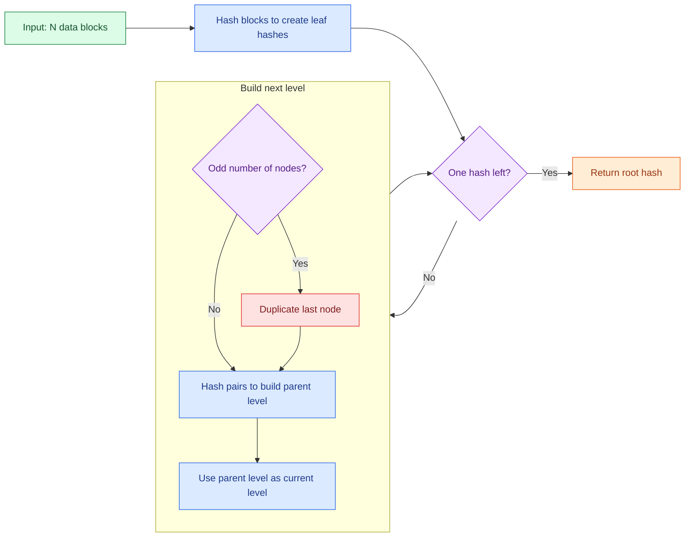

---
authors:
- copdips
categories:
- algo
comments: true
date:
  created: 2026-05-08
  updated: 2026-05-09
description: A summary of the Medium post on Merkle Trees, a core data structure behind blockchain, Git, and distributed systems.
---

# Merkle Trees (Hash Trees)

This post is an AI-generated summary of the Medium article [Advanced Algorithms Every Senior Developer Must Know: Part 1 — Merkle Trees](https://medium.com/@mr.sourav.raj/advanced-algorithms-every-senior-developer-must-know-part-1-merkle-trees-c7337f990607) from Sourav Chaurasia. It is intended as a concise reference to the key ideas.

## What Is a Merkle Tree?

A [Merkle tree](https://en.wikipedia.org/wiki/Merkle_tree) (also called a **hash tree**) is a binary tree structure invented by [Ralph Merkle](https://en.wikipedia.org/wiki/Ralph_Merkle) in 1979. It recursively hashes and combines data blocks to produce a single **root hash**, which serves as a cryptographic fingerprint of the entire dataset. It is used in many systems like Bitcoin, Git, IPFS, and Cassandra for efficient data verification and integrity.

<!-- more -->


**Legend:** 📦=Data Block　🟢=Leaf Hash　🔷=Branch Hash　🌐=Root Hash

```
                        🌐 Root Hash
                             ▲
                             │
                   ┌─────────┴─────────┐
                   │                   │
              🔷 Branch_AB        🔷 Branch_CD
                   ▲                   ▲
              ┌────┴────┐         ┌────┴────┐
              │         │         │         │
         🟢 Hash_A   🟢 Hash_B  🟢 Hash_C  🟢 Hash_D
              ▲         ▲         ▲         ▲
              │         │         │         │
        📦 Data_A   📦 Data_B  📦 Data_C  📦 Data_D
```


## Construction Process (4-Block Example)

### Step 1: Hash each data block

**Legend:** 📦=Data Block　🟢=Leaf Hash (newly created)

```
   🟢 Hash_A    🟢 Hash_B    🟢 Hash_C    🟢 Hash_D
       ▲            ▲            ▲            ▲
       │            │            │            │
    SHA256       SHA256       SHA256       SHA256
       ▲            ▲            ▲            ▲
       │            │            │            │
   📦 Data_A    📦 Data_B    📦 Data_C    📦 Data_D
```

### Step 2: Pair leaves and combine into branches

**Legend:** 🟢=Leaf Hash　🔷=Branch Hash (newly created)

> 💡 **Order matters.** `SHA256(Hash_A ‖ Hash_B)` is not the same as `SHA256(Hash_B ‖ Hash_A)`, so changing the order of data blocks changes the Merkle root.

```
              🔷 Branch_AB              🔷 Branch_CD
                   ▲                         ▲
              ┌────┴────┐               ┌────┴────┐
              │         │               │         │
         🟢 Hash_A   🟢 Hash_B     🟢 Hash_C   🟢 Hash_D

  Rule:  Branch_AB = SHA256( Hash_A ‖ Hash_B )
         Branch_CD = SHA256( Hash_C ‖ Hash_D )
```

### Step 3: Combine branches up to the root

**Legend:** 🟢=Leaf　🔷=Branch　🌐=Root (newly created)

```
                        🌐 Root Hash
                             ▲
                             │
                   ┌─────────┴─────────┐
                   │                   │
              🔷 Branch_AB        🔷 Branch_CD
                   ▲                   ▲
              ┌────┴────┐         ┌────┴────┐
              │         │         │         │
         🟢 Hash_A   🟢 Hash_B  🟢 Hash_C  🟢 Hash_D

  Root Hash = SHA256( Branch_AB ‖ Branch_CD )
```

## Merkle Proof — The Killer Feature

**Question:** How can we prove `Data_C` exists in the tree without downloading every block?

**Legend:** ✅=Trusted Root　🔑=Required Proof　🔵=Computed Locally　🎯=Target

```
                     ✅ Root Hash
                          ▲
                ┌─────────┴─────────┐
                │                   │
          🔑 Branch_AB         🔵 Branch_CD   ← compute locally
                                    ▲
                              ┌─────┴─────┐
                              │           │
                         🔵 Hash_C    🔑 Hash_D
                              ▲
                         🎯 Data_C
```

**What the verifier needs:**

- ✅ **Trusted Root Hash** (already known from a reliable source)
- 🎯 **Target Data Block** (`Data_C`, the one being verified)
- 🔑 **Sibling Hashes along the path** (only `log₂(n)` of them: `Hash_D` and `Branch_AB`)

### Verification Walkthrough

The **prover** has the full tree. For target `Data_C`, it builds a **Merkle proof** by collecting only the sibling hashes along `C`'s path to the root, plus their left/right positions:

```text
Proof for Data_C:
1. right sibling = Hash_D
2. left sibling  = Branch_AB
```

These are the only hashes the verifier needs for this example:

- `Hash_C` pairs with `Hash_D` to rebuild `Branch_CD`
- `Branch_CD` pairs with `Branch_AB` to rebuild the root

If the prover sent some unrelated hash such as `Hash_E`, the recomputed root would not match the trusted root hash.

**Legend:** 🎯=Target　🔵=Local Computation　🔑=Provided Proof　✅=Verified

```
   🎯 Data_C
      │
      │  Step 1: hash the target yourself
      ▼
   🔵 Hash_C_local              ←── computed locally
      │
      │  Step 2: combine with 🔑 Hash_D (right sibling)
      ▼
   🔵 Branch_CD_local           ←── computed locally
      │
      │  Step 3: combine with 🔑 Branch_AB (left sibling)
      ▼
   🔵 Root_Calculated
      │
      │  Step 4: compare with ✅ Trusted Root Hash
      ▼
  ┌────────────────────────────────┐
  │  match    →  ✅ DATA IS VALID  │
  │  no match →  ❌ DATA TAMPERED  │
  └────────────────────────────────┘
```

Equivalent formulas:

```text
Hash_C_local      = SHA256(Data_C)
Branch_CD_local   = SHA256(Hash_C_local || Hash_D)
Root_Calculated   = SHA256(Branch_AB || Branch_CD_local)
```

> 💡 1,000 data blocks need only **~10 🔑 sibling hashes (≈320 bytes)** to verify — not the full 1,000-block dataset!


## Handling an Odd Number of Blocks

When the leaf count is odd, **duplicate the last block** to make it even, then continue building.

This is one common convention for binary Merkle trees, including Bitcoin-style examples. Under this convention, if you append a new block:

- if the previous leaf count was **even**, the new last block is temporarily duplicated
- if the previous leaf count was **odd**, the previously duplicated last block is replaced by the new real block

Example:

```text
3 blocks:  A  B  C      -> duplicate C  -> A  B  C  C
4 blocks:  A  B  C  D   -> already even -> A  B  C  D
5 blocks:  A  B  C  D  E -> duplicate E -> A  B  C  D  E  E
```

**Legend:** 📦=Data　🟢=Leaf Hash　🔷=Branch　🌐=Root　♻️=Duplicated Node

```
  Before (3 blocks, odd) :  📦 Data_A   📦 Data_B   📦 Data_C
                                                          │
                                                     ♻️ duplicate
                                                          ▼
  After  (4 blocks, even):  📦 Data_A   📦 Data_B   📦 Data_C   ♻️ Data_C'

                          🌐 Root Hash
                               ▲
                     ┌─────────┴─────────┐
                     │                   │
                🔷 Branch_AB        🔷 Branch_CC'
                     ▲                   ▲
                ┌────┴────┐         ┌────┴────┐
                │         │         │         │
           🟢 Hash_A   🟢 Hash_B  🟢 Hash_C  ♻️ Hash_C
```

## Build Algorithm Flow



## Performance Analysis

**Legend:**

- 🚀 = Sub-linear   (scales WAY better than data size)
- ⚡ = Linear       (scales proportionally to data size — unavoidable lower bound)
- 🐢 = Super-linear (scales WORSE than data size — would be a problem)

```
   Operation              Complexity      Scaling     For n = 1,000,000
   ─────────────────────────────────────────────────────────────────────
   🔨 Build the tree       O(n)            ⚡        ~1,000,000 hashes
   🔍 Generate a proof     O(log n)        🚀        ~20 hashes
   ✅ Verify a proof       O(log n)        🚀        ~20 hashes
   💾 Storage footprint    O(n)            ⚡        ~2,000,000 nodes
   ─────────────────────────────────────────────────────────────────────
   🐢 (No super-linear operations — that's the whole point of Merkle Trees!)
```

### 🔥 Real-World Comparison (2,000 Data Blocks)

```
   ❌ Traditional approach:
   ┌──────────────────────────────────────┐
   │ ████████████████████████████████████ │  ~2 MB
   └──────────────────────────────────────┘
        Download ALL 2,000 blocks

   ✅ Merkle proof:
   ┌─┐
   │█│  ~352 bytes
   └─┘
        Download only ~11 sibling hashes

   📉 Bandwidth savings: 99.98%
```

## Real-World Applications

Merkle trees aren't just theory — they power some of the most-used systems on the planet. Each application uses the tree slightly differently. Let's look at four of the most important ones.

### 🔗 Bitcoin (Blockchain) — SPV Wallets

**Problem:** A mobile Bitcoin wallet on your phone can't store the full ~600 GB blockchain.

**Solution:** **Simplified Payment Verification (SPV)** — verify that *your* transaction is in a block using only its Merkle proof.

**Legend:**

- ✅=Block Header (small, always synced)　

- 🔑=Sibling Proof　

- 🎯=Your Transaction　

- 📦=Other Transactions (NOT downloaded)

```
   Block Header (~80 bytes, always synced by SPV wallet):
   ┌─────────────────────────────────────────┐
   │  Previous Block Hash                    │
   │  Timestamp │ Difficulty │ Nonce         │
   │  ✅ Merkle Root  ◀── trusted anchor     │
   └─────────────────────────────────────────┘
                       │
                       ▼ (your wallet asks: "is Tx_C in this block?")

                     ✅ Merkle Root
                          ▲
                ┌─────────┴─────────┐
                │                   │
           🔑 Branch_AB        Branch_CD
                                    ▲
                              ┌─────┴─────┐
                              │           │
                           Hash_C       🔑 Hash_D
                              ▲
                         🎯 Your Tx_C

   📦 Tx_A  📦 Tx_B  🎯 Tx_C  📦 Tx_D  ... 📦 Tx_2000
   ░░░░░░░░░░░░░░░░░░░░░░░░░░░░░░░░░░░░░░░░░░░░░░░░░
   ▲ NOT downloaded — full node only sends 🔑 sibling hashes

   Total downloaded: 1 block header + 11 sibling hashes ≈ 432 bytes
   Instead of:       full 1 MB block (~99.96% bandwidth saved)
```

### 📚 Git (Version Control) — Commit Integrity sdfsdfsdf

**Problem:** How does Git detect if even a single byte of any file in your repo has been tampered with — across millions of commits?

**Solution:** Every Git **commit, tree, and blob** is content-addressed by its SHA-1 hash. A commit is essentially a Merkle Root over your entire project state.

**Legend:** 🟠=Commit　🌳=Tree (directory)　📄=Blob (file content)　🔗=hash pointer

```
                      🟠 Commit "abc123..."
                       │
                       │  (points to root tree hash)
                       ▼
                     🌳 Tree (root directory)
                       ▲
              ┌────────┼────────┐
              │        │        │
              ▼        ▼        ▼
           🌳 src/  🌳 tests/  📄 README.md
              ▲        ▲        (hash: 5d4e1c...)
        ┌─────┴────┐   │
        │          │   ▼
        ▼          ▼   📄 test_main.py
   📄 main.py  📄 utils.py    (hash: 7448d8...)
   (hash:      (hash:
    a665a4...)  d1d4e1...)

   ──────────────────────────────────────────────
   💡 Change ONE byte in main.py
      → main.py's hash changes
      → src/'s tree hash changes
      → root tree hash changes
      → Commit hash changes
   ──────────────────────────────────────────────
   Result: tampering ANY file is instantly detectable.
```

### 🗄 Apache Cassandra (Distributed DB) — Anti-Entropy Repair

**Problem:** Two database replicas in different data centers might drift out of sync. Comparing all records row-by-row would take hours.

**Solution:** Each replica builds a Merkle tree over its data. Compare **root hashes first** — if they match, done. If not, **drill down recursively** to find only the differing branches.

**Legend:** ✅=match　❌=mismatch　🟢=in sync　🔴=needs repair

```
   Replica A (Data Center 1)        Replica B (Data Center 2)
   ─────────────────────────        ─────────────────────────

       Root Hash                          Root Hash
        ❌ aaa111            ←≠→            ❌ bbb222
            │                                  │
     ┌──────┴──────┐                    ┌──────┴──────┐
     │             │                    │             │
   ✅ x1y2       ❌ p3q4               ✅ x1y2       ❌ z5z5
   (match,        │                    (match,         │
    skip!)        │                     skip!)         │
              ┌───┴───┐                            ┌───┴───┐
              │       │                            │       │
            ✅ aa    ❌ bb                       ✅ aa   🔴 cc
                      │                                    │
                  🔴 Diff!                              🔴 Diff!
                  (only sync                            (only sync
                  this subtree)                         this subtree)

   ──────────────────────────────────────────────────────────
   💡 1 million records, only 2 differ?
      → 20 hash comparisons (log₂ 1M) instead of 1M comparisons
      → ~50,000× speedup ⚡
   ──────────────────────────────────────────────────────────
```

### 🌐 IPFS / BitTorrent (P2P Networks) — Chunk Verification

!!! note "IPFS stands for "InterPlanetary File System" — a distributed file storage protocol. BitTorrent is a popular P2P file sharing protocol. Both use Merkle trees to verify the integrity of file chunks downloaded from untrusted peers."

**Problem:** You're downloading a 4 GB file from random untrusted peers. How do you detect if any peer sent corrupted or malicious chunks?

**Solution:** The file's "address" is its Merkle Root. Every downloaded chunk can be independently verified against this root.

**Legend:** 🌐=Content ID (Root)　🔷=Branch　📦=File Chunk　🤝=trusted peer　⚠️=malicious peer

```
   File "movie.mp4" (4 GB) split into 4 chunks:

                    🌐 Content ID = SHA256(...) ← "address" of the file
                          ▲
                ┌─────────┴─────────┐
                │                   │
           🔷 Branch_AB        🔷 Branch_CD
                ▲                   ▲
           ┌────┴────┐         ┌────┴────┐
           │         │         │         │
        Hash_A    Hash_B    Hash_C    Hash_D
           ▲         ▲         ▲         ▲
           │         │         │         │
       📦 Chunk_A 📦 Chunk_B 📦 Chunk_C 📦 Chunk_D
       (1 GB)    (1 GB)    (1 GB)    (1 GB)

   ──────────────── Download phase ────────────────

   🤝 Peer 1 sends Chunk_A  → SHA256(Chunk_A) == Hash_A  ✅ keep
   🤝 Peer 2 sends Chunk_B  → SHA256(Chunk_B) == Hash_B  ✅ keep
   ⚠️ Peer 3 sends Chunk_C' → SHA256(Chunk_C') ≠ Hash_C  ❌ reject!
   🤝 Peer 4 sends Chunk_D  → SHA256(Chunk_D) == Hash_D  ✅ keep

   ──────────────────────────────────────────────────
   💡 Each chunk verified independently against the
      Content ID — no peer can sneak in malicious data.
   ──────────────────────────────────────────────────
```


### 📊 Application Comparison Summary

| Use Case | What's a "Block"? | What's the Root? | Why Merkle Tree? |
|----------|-------------------|------------------|-------------------|
| 🔗 **Bitcoin SPV** | One transaction | `Merkle Root` in block header | Verify Tx without 600 GB chain |
| 📚 **Git** | One file (blob) | Commit hash | Detect any tampering across commits |
| 🗄 **Cassandra** | One DB record | Per-replica root | Find diffs without scanning all rows |
| 🌐 **IPFS / Torrent** | One file chunk | Content ID (CID) | Verify chunks from untrusted peers |

## Summary

**🌳 Merkle Tree** = `🛡️ Data Integrity` + `🚀 Efficient Proof` + `🔒 Tamper Detection`

Compress an entire dataset into a single **🌐 Root Hash**, then prove the existence and integrity of any individual record at the cost of just **O(log n)** sibling hashes.

That's exactly why **🔗 Bitcoin · 📚 Git · 🌐 IPFS · 🗄 Cassandra · 🔗 Ethereum** all rely on it.

## 📖 Glossary

| Term | Meaning |
|------|---------|
| **Data Block** | A single unit of raw input data — could be a file, a record, a transaction, a chunk of bytes, etc. |
| **Leaf Hash** | The hash of one data block — sits at the bottom of the tree |
| **Branch Hash** (a.k.a. Inner / Internal Hash) | The hash of two child hashes concatenated together |
| **Root Hash** (a.k.a. Merkle Root) | The single top-level hash representing the entire dataset |
| **Sibling Hash** | The "other child" of a parent node — needed during proof verification |
| **Merkle Proof** | The minimal set of sibling hashes required to verify one data block |
| **SHA256** | A standard cryptographic hash function producing a 256-bit (32-byte) output |
| **‖** (concatenation) | The operator that joins two hashes byte-wise before hashing them together |

**Tags:** `🔒 Cryptographically Secure` · `🚀 O(log n) Verification` · `🌐 Distributed Systems` · `🛡️ Tamper-Proof` · `🔗 Blockchain` · `📚 Git` · `🌐 IPFS` · `🗄 Cassandra`
