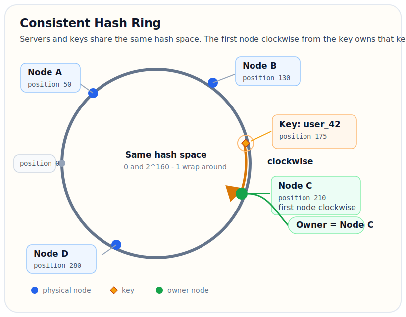

---
authors:
- copdips
categories:
- algo
comments: true
date:
  created: 2026-05-14
description: A summary of the Medium post on Consistent Hashing, a key technique for distributed systems and caching.
---

# Consistent Hashing

This post is an AI-generated summary of the Medium article [Advanced Algorithms Every Senior Developer Must Know: Part 2 — Consistent Hashing](https://medium.com/@mr.sourav.raj/advanced-algorithms-every-senior-developer-must-know-part-2-consistent-hashing-78fd2413a5ae) from Sourav Chaurasia. It is intended as a concise reference to the key ideas.

Consistent hashing solves one problem: **when the number of servers changes, not every stored key should have to move to a different server**.
Here, a key can be a cached object, a user session, or a database record. If almost every key gets remapped after adding or removing one server, caches are invalidated and a lot of data has to be redistributed.

<!-- more -->

Traditional hashing is simple:

```text
server = hash(key) % N
```

But when `N` changes, the result changes for almost every key.

```text
hash("user_42") = 175

N = 4  ->  175 % 4 = 3   -> server_3
N = 5  ->  175 % 5 = 0   -> server_0
```

Add one server, and the whole cache can reshuffle.

<!-- more -->

## The Idea

Hash **servers** and **keys** into the same ring space.
If `user_42` hashes to position `175`, it belongs to the **first server clockwise** from that point, here `Node C` at position `210`. This gives every key exactly one owner.

<p align="center">
  
</p>

## Why It Helps

When a server is added or removed, only one slice of the ring changes owner.

Before adding `X`:

```text
positions
0 ────────────●────────────────────●──────────────────●──── 360
            80                   220              310
          Node B                 Node C          Node D

Node B owns (prev(Node B), 80]
Node C owns (80, 220]
Node D owns (220, 310]
```

After adding `X = 160`:

```text
positions
0 ────────────●─────────●──────────●──────────────────●──── 360
            80        160        220               310
          Node B    Node X     Node C             Node D

Node X owns (80, 160]   <- moved from Node C
Node C now owns (160, 220]
everything else is unchanged
```

So the new server steals only part of one old server's range.
On average, adding or removing one server moves about **total keys / number of servers** keys, not **all keys**.

## Why Load Is Roughly Balanced

If the hash function spreads values well, keys and servers are spread around the ring too.
Each server owns one arc, so each server gets roughly its share of keys.

But with only a few physical servers, the arcs can still be uneven:

```text
positions
0 ────●────●────────────────────────────────────●───────────── 1000
    10    50                                   600
  Node A Node B                               Node C

Node A owns (600, 10]  = 410
Node B owns (10, 50]   = 40
Node C owns (50, 600]  = 550

load
Node A : ████████
Node B : █
Node C : ███████████
```

Even with perfectly uniform keys, `Node C` gets much more traffic than `Node B`.

## The Fix: Virtual Nodes

Instead of putting each physical server on the ring once, put it there many times.

```text
without virtual nodes

🟢A ───── 🟢B ─ 🟢C ─────────── 🟢D    ← lopsided arcs

with virtual nodes

🔹A 🔹C 🔹B 🔹A 🔹D 🔹B 🔹C 🔹A 🔹D ...  ← many small slices
```

Now each physical server owns many small slices instead of one big slice.
That makes load much smoother in practice.

Common setup:

- `N` = physical servers
- `V` = virtual nodes per server
- total ring points = `N * V`

## Lookup Cost

Store server positions in sorted order.
For a key:

1. hash the key
2. find the first server position `>= key`
3. if none exists, wrap to the first server

With a sorted array, lookup is **O(log N)** (bisect), or more precisely **O(log(N * V))** when virtual nodes are used.

## Summary

- Problem   : hash(key) % N breaks when N changes
- Solution  : put keys and servers on the same ring
- Rule      : first server clockwise owns the key
- Benefit   : only about K/N (all keys / server number) keys move on topology change
- Fix       : use virtual nodes to smooth uneven load

## Python Example

```python
import hashlib
import bisect


class ConsistentHashWithVirtualNodes:
    def __init__(self, virtual_nodes=150):
        self.virtual_nodes = virtual_nodes

        # {hash_value: physical_server}
        self.ring = {}

        # sorted hash positions on the ring, used for binary search
        self.sorted_keys = []

    def _hash(self, key):
        md5 = hashlib.md5(key.encode()).hexdigest()
        return int(md5[:8], 16)

    def add_server(self, server):
        """Create virtual nodes for each physical server."""
        for i in range(self.virtual_nodes):
            # e.g. "Server_A#0", "Server_A#1", ...
            virtual_key = f"{server}#{i}"
            h = self._hash(virtual_key)

            # many virtual nodes point to one physical server
            self.ring[h] = server

            # insert and keep orders sorted for binary search
            bisect.insort(self.sorted_keys, h)

    def remove_server(self, server):
        for i in range(self.virtual_nodes):
            virtual_key = f"{server}#{i}"
            h = self._hash(virtual_key)
            if h in self.ring:
                del self.ring[h]
                self.sorted_keys.remove(h)

    def get_server(self, key):
        if not self.ring:
            return None

        h = self._hash(key)

        # Binary search in O(log M), where M = len(self.sorted_keys).
        # It returns the first position whose hash is >= the key hash.
        idx = bisect.bisect_left(self.sorted_keys, h)

        # Wrap around to the first node on the ring.
        if idx == len(self.sorted_keys):
            idx = 0

        return self.ring[self.sorted_keys[idx]]
```

## Replication

Databases (e.g. Cassandra) replicate each record to RF (replication factor, typically 3) **distinct physical nodes** to tolerate hardware failure.

The algorithm extends naturally: **walk clockwise from the key's position, collecting the first RF distinct physical nodes**. If the next vnode you encounter belongs to an already-collected physical node, skip it and keep walking. This guarantees the RF copies live on different hardware.

```text
🎯 Key "order_99"
│
▼ (walk clockwise, skipping repeated physical nodes)
1️⃣ Node_B  ─►  2️⃣ Node_C  ─►  3️⃣ Node_A
(primary)     (replica)       (replica)
```

Production systems also do "rack/datacenter awareness" — beyond "different physical node", they require "different rack" or "different DC" to tolerate rack/DC-level outages.

## Bounded-Load Variant — Preventing Hotspots

Even with vNodes giving even average distribution, **per-key access frequency** may be wildly skewed. A trending news article or celebrity account can hammer one node. This isn't about keys being uniformly distributed — some keys are simply hot.

**Bounded-load** variant: each node has a cap:

```text
max load per node = average load × load_factor
                  = (total requests / N) × load_factor
```

`load_factor` is slightly > 1, typically 1.25 (allowing 25% over average).

When a request arrives, find its "natural" owner via consistent hashing. **If that node is already over its cap, keep walking clockwise until you find a node still under its cap**, and route there.

Legend: 🟢=Below cap 🟡=Near cap 🔴=At cap ➡=Spill to next node

```text
🔑 hot_key  ➡  🔴 Node_B (full)  ➡  🟡 Node_C (not full)  ➡  accept at Node_C
```

This preserves locality for most requests while preventing a few hot keys from crushing a single node.

!!! warning "Tradeoff: Bounded-load adds complexity on Stale Routing After Load Recovery"
     In consistent hashing with overload-based spillover, we face a read/write routing mismatch problem (there're multiple solutions but won't cover here):

     Timeline of the issue:

     T1: Node A is overloaded (120%)

          → Write key X is redirected to Node B (the next available node)

          → Data X now lives on B

     T2: Node A's load drops back to normal (50%)

          → Read request for key X comes in

          → hash(X) → A (A is not overloaded anymore)

          → Read goes to A → ❌ CACHE MISS / DATA NOT FOUND

          → But the data is actually on B!

## Performance Analysis

```text
   Operation         Traditional hashing       Consistent hashing
   ──────────────────────────────────────────────────────────────────
   🔍 Key lookup     O(1) — direct mod         O(log N) — binary search on sorted ring
   🔨 Add/remove     O(K) keys remapped        O(K/N) keys remapped
   💾 Memory         O(N) — just node list     O(V × N) — also stores vNodes
   ❌ Topo change    ~100% cache invalidation  ~1/N cache invalidation

   Where:
     K = total number of data keys
     N = number of physical nodes
     V = number of virtual nodes per physical node
```

Measurement from the article: 100,000 cached keys, scaling from 4 → 5 servers:

- **Modulo hashing**: ~80,000 keys (80%) moved
- **Consistent hashing**: ~20,000 keys (20%, close to K/N = 100,000/5 = 20,000)

Cache hit rate ~4× better; network traffic reduced ~75%.

## Real-World Applications

**☁️ Amazon DynamoDB**: distributes items by partition key via consistent hashing. Partition capacity drives node weight (high-capacity partitions get more vNodes), and hot partitions auto-split without downtime. Handles 20M+ requests/sec, typically <10ms latency, across 25+ regions.

**🪶 Apache Cassandra**: **default 256 vNodes per node**, replication factor (RF) typically 3. Reads/writes routed by partition key; consistency level decides how many replicas must respond (ONE = 1, QUORUM = ⌊RF/2⌋+1 = 2, ALL = RF = 3). On node failure, hinted handoff and repair recover automatically; the ring keeps serving traffic.

**🌐 Netflix CDN**: ~15,000 cache servers worldwide. Adding 100 servers would invalidate 99% of caches with modulo; only 0.7% with consistent hashing. Saves $2M+ in bandwidth per scaling event.

**💬 Discord**: 500+ chat servers serving 140M+ users. On node failure, consistent hashing rebalances load in under 1 second, sustaining 99.99%+ uptime during peak gaming hours.

**⚖ Load balancers**: hash session ID or client IP onto a ring of backends — automatically delivers **sticky sessions** (same user keeps hitting the same backend until topology changes).

## Hierarchical (Multi-Tier) Hashing

Global services chain multiple rings: a top-level ring picks a **region** (e.g. by user location), a second ring picks a **datacenter** within that region, a third ring picks a **server** within that DC.

Legend: 🌍=Region ring 🏢=DC ring 🖥=Server ring

```text
   user_location ─► 🌍 Region Ring         ─► "eu-west"
                                                │
   data_key      ─► 🏢 DC Ring(eu-west)     ─► "eu-west-1"
                                                    │
   data_key      ─► 🖥 Server Ring(eu-west-1) ─► "server-3"

   Final route: eu-west / eu-west-1 / server-3
```

This keeps traffic geographically local while each tier internally enjoys consistent-hashing-based elasticity.

## Common Pitfalls

1. **bad hash function** (e.g. Java's default `hashCode`) causes clustering on the ring; use SHA-1/MD5 or similar well-distributed cryptographic hashes.
2. **too few vNodes** (V < 50) leaves load unbalanced; start with 100-200. 3. **ignoring heterogeneous hardware** — weight nodes by CPU/RAM/network and translate that into vnode counts.
3. **poor replica placement** can put all copies on the same rack; implement rack/DC awareness.
4. **no bounded-load protection** — a viral key can melt a single node; production needs spillover/degradation policies.
